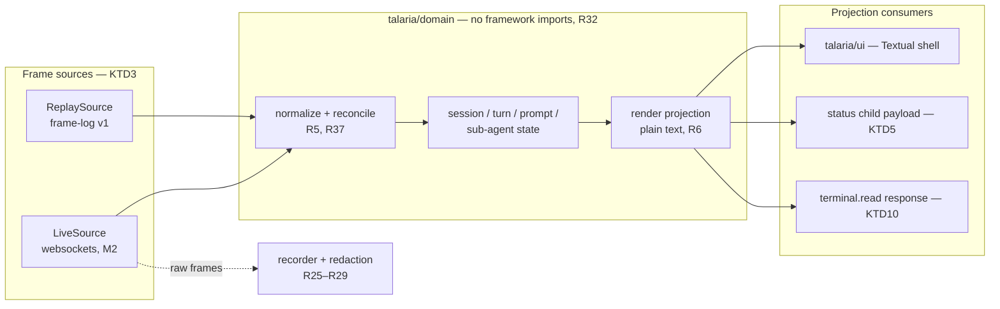

# Talaria v0.1 prototype — implementation plan

## Summary

Build Talaria v0.1 in two milestones: milestone 1 drives the entire interface from recorded frame
logs with no gateway present (recorder, domain core, Textual shell, status runner — the framework
validation gate and the prototype are the same build), and milestone 2 swaps in the live
authenticated socket and completes the blocking-prompt, slash-command, and daily-driver surfaces.
Ten units, dependency-ordered, closing planning obligations PC1–PC10 from the origin document.

---

## Problem Frame

The WHAT is settled: `docs/brainstorms/2026-08-02-talaria-v0-1-prototype-requirements.md` fixes 40
requirements, 7 flows, 16 acceptance examples, and 10 planning obligations, and its doc review
(`docs/reviews/2026-08-02-talaria-v0-1-prototype-requirements-doc-review-reconciliation.md`)
verified every protocol claim against Hermes `7f4d15515` and marked the document ready for `/plan`.

**Carried-forward stop condition — CLEARED by operator override, 2026-08-02.** That reconciliation
recorded `blocked_for_work: true` on finding DR15: the independent review panel over the
requirements dispatched three units but only one left a completed final-response receipt
(`docs/reviews/evidence/2026-08-02-talaria-requirements-panel-completion.json`).

The override rationale is that DR15 is a receipt-keeping gap, not a review gap, and it is
unsatisfiable as written — the reconciliation itself records that "the panel-independence property
has no mechanical verifier in the available tooling," so no re-run can close it either. The
substantive obligation DR15 stands in for has since been discharged well past its own bar: the
requirements carry a full doc review plus an external reconciliation, and this plan carries a doc
review plus a two-engine external panel (`codex/gpt-5.6-sol` and `ollama-cloud/kimi-k3`, both at
maximum reasoning effort), whose findings were verified against primary sources and applied across
two rounds. Talaria v0.1 has one operator, who is also its only intended user; no further
independent-review ceremony is a prerequisite to writing code. **U1 may begin.**

The second stop condition — the P0 credential finding against KTD11 — is **also cleared**: KTD11
below now records the verified mechanism and the settled v0.1 decision.

This plan fixes the HOW: package layout, typed-model strategy, the frame-source seam, the composer
widget, the frozen status contract, the recorder-equivalence relation, credential acquisition, the
compatibility baseline, and the unit order that lets the framework gate fail early and cheaply. All
four ADRs constrain it; none is re-litigated here.

---

## Requirements

The origin document's R1–R40, F1–F7, AE1–AE16, and PC1–PC10 are this plan's requirement set,
incorporated by reference and never renumbered. The table below discharges the origin's traceability
obligation: every individual requirement is assigned to concrete units and executable evidence.
Test paths are repo-relative; `gate` means the U5 validation-gate run and its recorded results.

| R-ID | Units | Executable evidence |
| ---- | ----- | ------------------- |
| R1 | U7, U10 | `tests/transport/test_attach.py` — loopback `?token=` attach (KTD11), no credential in argv, and every URL that reaches a record passes `redactUrl`. The former claim that "AE10 install check greps process listing" is withdrawn: origin AE10 contains no such check. The process-surface assertion is now **owned by U10** (`tests/ui/test_teardown.py`), where the process inventory already runs |
| R2 | U3, U7, U10 | `tests/domain/test_startup_precedence.py` (AE12 cases); live startup acceptance is now an explicit U10 test scenario and verification item |
| R3 | U3, U5, U7, U10 | `tests/domain/test_transcript_state.py` streaming fixtures; gate replay; the live turn is now an explicit U10 test scenario and verification item |
| R4 | U3, U7 | `tests/domain/test_turn_lifecycle.py` — cancelled is terminal, late completion ignored |
| R5 | U3 | `tests/domain/test_normalize.py` — unknown-type surfaced, malformed frame → protocol error, no raw bytes |
| R6 | U3, U5 | `tests/domain/test_projection.py` — content completeness under plain-text rendering; gate reflow (AE5) |
| R7 | U8 | `tests/transport/test_bridges.py` — approval + four bridges answered in place; isolated live acceptance |
| R8 | U3, U8 | `tests/domain/test_prompt_registry.py` — request_id keying, expiry leaves transcript trace, late respond rejected (AE8) |
| R9 | U2, U6, U7, U8 | `tests/recorder/test_redact.py` (AE3 sweep); `tests/status/test_env.py`; `tests/transport/test_attach.py` URL hygiene; `tests/transport/test_bridges.py` + `tests/ui/test_prompts.py` respond hygiene. Two paths handle an operator-typed credential live and each needs its own evidence: U8's secret/sudo respond fields, and KTD11's interactive hidden credential prompt in U7 |
| R10 | U5 | `tests/ui/test_composer.py` — bordered region present while transcript streams (Pilot) |
| R11 | U5 | gate AE4 cases — paste, wide/combining chars, IME text via `TextArea` |
| R12 | U5 | `tests/ui/test_composer.py` — multi-line entry; submit vs newline bindings discoverable |
| R13 | U9 | `tests/transport/test_paste_collapse.py` — placeholder on success; original text intact on failure (AE13) |
| R14 | U3, U5 | `tests/domain/test_subagents.py`; `tests/ui/test_agent_rows.py` — rows visible during parent stream |
| R15 | U5, U9 | interrupt control inert in replay (AE11), dispatches `subagent.interrupt` live; transcript retained (AE14) |
| R16 | U3, U5 | projection exposes count when collapsed; Pilot snapshot |
| R17 | U3 | compat baseline (U3 data) contains no sub-agent authoring method; review check |
| R18 | U6 | `tests/status/test_runner.py` — argv exec, no shell, stdin payload, interval tick |
| R19 | U3, U6 | `tests/status/test_payload_schema.py` — version field, frozen v1 field set |
| R20 | U6 | `tests/status/test_env.py` — sanitized env, allowlist only, no framework types in payload |
| R21 | U6 | failure matrix: nonzero exit, hang, overlap, empty, invalid, oversize, missing binary (AE1) |
| R22 | U6, U5 | row-bound truncation visible; output rendered literal, ANSI not interpreted |
| R23 | U9 | `tests/transport/test_commands.py` — catalogue fetched, official-client-local entries marked unsupported (AE9) |
| R24 | U3, U9 | `tests/domain/test_dispatch_results.py` — six result shapes generic, display projection only |
| R25 | U2 | `tests/recorder/test_recorder.py` — one header per file, create/write/flush/close failures surfaced (AE15) |
| R26 | U2 | `tests/recorder/test_recorder.py` — redaction before disk, parse-error hole categorical, raw bytes withheld |
| R27 | U2 | `tests/recorder/test_redact.py` — full TS case port + re-verification against pinned registrations |
| R28 | U2 | `tests/recorder/test_equivalence.py` — TS/Python contract equivalence (AE6); outbound synthetic-credential test |
| R29 | U1, U2 | `.gitignore` covers corpora; committed fixtures are small synthetic frames only |
| R30 | U5 | gate runs the full interface from a frame log with no socket open |
| R31 | U7 | `tests/transport/test_source_equivalence.py` — replay and live sources produce identical domain transitions (AE16) |
| R32 | U1 | `tests/domain/test_boundary.py` — domain import of `textual` fails the domain test run |
| R33 | U1 | CI check: ruff + mypy --strict + pytest + bandit green from the first Python commit (AE10) |
| R34 | U3, U10 | `tests/transport/test_compat_baseline.py` — read-only startup checks only; missing method named, verdict blocked (AE7) |
| R35 | U7 | `tests/transport/test_reconnect.py` — distinct states; lost-RPC outcome unknown; no duplicate transcript (AE8) |
| R36 | U6, U10 | `tests/ui/test_teardown.py` + PTY exit checks — terminal restored, children stopped, gateway untouched (AE10) |
| R37 | U3 | reconciliation-catalogue doc at pin + `tests/domain/test_reconciliation.py` determinism fixtures (AE2, AE14) |
| R38 | U5 | gate measurements against pinned corpus and thresholds (AE5, AE16); `tests/ui/test_transcript_bounds.py` |
| R39 | U10 | clean-environment `uv tool install` CI job + recorded platform matrix (AE10) |
| R40 | U5, U6 | `tests/replay/test_controls.py` — pause/resume/speed; mutation controls inert; status command exercised (AE11) |

---

## Key Technical Decisions

Each decision constrains implementation; the rationale names the tradeoff. KTDs mirror to
`docs/engineering-journal/DECISIONS.md` (canonical) in the same commit as this plan.

**KTD1 — Top-level `talaria/` Python package with uv, ruff, mypy --strict, pytest, and bandit from
the first commit:** the TypeScript tree stays untouched under `src/` as reference behavior
(ADR-0004 "stale as a result"), so the Python package roots at the repo top level rather than
inside `src/`, with a root `pyproject.toml` exposing the `talaria` console script via
`[project.scripts]` for `uv tool install` (R39). Toolchain matches ADR-0004's first-commit gates
and the surrounding-repo convention (ruff at 100-char line length); bandit is added because this
codebase's worst failure mode is credential handling.

**KTD2 — Protocol models are frozen dataclasses with explicit decoders, not Pydantic:** the domain
core stays dependency-free (cheapest possible replay tests, importable anywhere), and hand-written
`decode()` functions are exactly where unknown-event surfacing (R5) and malformed-frame errors
(R37) must live — a validation library's coercion would paper over the malformations the
requirements want surfaced. Revisit if decoder boilerplate materially outgrows its value in
milestone 2; the wire-boundary module is the only place that would change.

**KTD3 — One `FrameSource` seam feeds everything:** an iterator protocol yielding raw frame records
(direction, observed time, payload) with two implementations — `ReplaySource` reading frame-log v1
with pause/resume/speed (R40, timing scaled from recorded `at` deltas), and `LiveSource` (milestone
2) wrapping the socket. Everything above the seam is identical code in both modes, which is what
makes R31 and AE16 testable rather than aspirational.

The seam is **async**, and declared in `talaria/transport/source.py` — not in `talaria/domain/`,
because a live implementation owns a socket and ADR-0002 keeps I/O out of the domain package;
`ReplaySource` imports it from there without importing anything else in `talaria/transport/`. It is
an `AsyncIterator[FrameRecord]` plus `async def close()`, which is idempotent, cancels any in-flight
read, and is guaranteed to run on both normal exit and induced failure (R36's teardown clause). A
consumer that stops iterating without calling `close()` is a test failure, not a tolerated pattern.

**KTD4 — The composer is Textual's `TextArea` configured as a plain-text chat editor; Enter
submits, Ctrl+J inserts a newline, paste inserts literally:** `Input` is single-line so R12
eliminates it; `TextArea` (verified in Textual 8.2.8: `language=None`, `soft_wrap=True`,
`show_line_numbers=False`, `placeholder`) is the only framework-provided multi-line editor R11
permits. Enter-submits matches Hermes and every chat UI; Ctrl+J is chosen over Shift+Enter because
plain LF is deliverable in every terminal while Shift+Enter requires kitty-protocol support the
supported matrix does not assume. Bracketed paste arrives as a single `events.Paste` and inserts
without submitting; the binding is documented in the composer placeholder (R12 discoverability).
The gate stress-tests this exact configuration (AE4); an IME or wide-character failure here is a
gate failure routed to PC8, not a workaround.

**KTD5 — Status contract v1 is frozen here (PC2):** delivery is one UTF-8 JSON document on the
child's stdin (matching the operator's prior-art harness and avoiding argv interpolation, R18);
output is newline-separated rows on stdout rendered as literal text. Executable path comes from
`status.command` in the KTD15 config and is exec'd directly — argv array, no shell. Fields:
`{version: 1, mode: "replay"|"live", connection: "disconnected"|"connecting"|"connected"|
"reconnecting"|"auth_failed", session: {id: str, title: str|null}, turn:
"idle"|"streaming"|"waiting"|"cancelled", pending_prompts: int, subagents: {active: int,
terminal: int}, usage: {input_tokens: int, output_tokens: int} | null}` — a projection of domain
state only, no
terminal-framework types, no credential-bearing values (R20). Interval default 10s (configurable),
timeout 2s then kill, overlap policy skip-while-running (at most one invocation, R21), output limit
16 KiB, row bound 8 rows with visible truncation (R22). Child env is default-deny: `PATH`, `HOME`,
`SHELL`, `TERM`, `LANG`/`LC_*`, `TMPDIR`, plus an explicitly enumerated set of `TALARIA_*` context
vars and an operator-configured allowlist — Talaria's own environment never passes through
wholesale. **A `TALARIA_*` prefix is not by itself a pass:** the prefix collides with KTD11's
credential namespace, so the deny is non-overridable — no variable whose normalized name matches
the Python port of `SENSITIVE_KEY_PATTERNS` (`talaria/recorder/redact.py`, U2's deliverable; U6
imports that one module rather than re-deriving the patterns from the TypeScript reference, so the
two copies of this security boundary cannot drift) is ever forwarded regardless of prefix or
allowlist entry. **`TALARIA_GATEWAY_URL` is forwarded to the child with its entire query string
removed** — scheme, host, and path only. Pattern-based redaction is *not* sufficient here: at the
pin the attach credential rides the URL query, and `redactUrl` matches the bare `token` key but
neither `ticket` nor `internal` (KTD11), so a gated-mode credential would pass a pattern filter
untouched and land in a subprocess environment on a ten-second timer. The child has no use for
query state, so dropping all of it costs nothing and does not depend on pattern coverage being
complete.

**The forwarded `TALARIA_*` set is exactly five variables** (PC2's remaining gap, now closed):
`TALARIA_CONFIG_DIR`, `TALARIA_GATEWAY_URL` (query string stripped entirely, above),
`TALARIA_PROFILE`, `TALARIA_LOG_LEVEL`, and `TALARIA_STATUS_INTERVAL`. Anything else carrying the
prefix is dropped. The credential-shaped deny above outranks this list and the operator allowlist
both.

**Process contract, frozen (PC2's other gap).** The child's stderr is captured separately from
stdout, capped at 4 KiB, and surfaced only in the categorical failure marker — never rendered into
the status region, so a chatty script cannot impersonate status rows. Working directory is the
directory Talaria was launched from, not the config directory, matching the operator's prior-art
harness which shells out to `git -C <cwd>`. Stdin is closed after the payload is written, so a
script that reads to EOF terminates rather than hanging into the 2s timeout. Termination is
**process-group scoped**: the child is spawned in a new process group (`start_new_session=True`)
and the timeout kill signals the group, not the single process — R36's "stops the status child"
promise is otherwise false the moment a shell script backgrounds anything, which the prior-art
harness does routinely (`git`, `sqlite3`, `kubectl`).

*Provisional and versioned:* the field **set** above is frozen for v1 and `version: 1` is the
compatibility signal. The domain state behind it is not fully known until U3 ships, so adding
fields is a `version: 2` change with the v1 shape still emitted on request — the process contract,
limits, and environment rules in this KTD do not move with it.

**KTD6 — Recorder equivalence normalizes observation fields and requires everything else equal
(PC4):** for equivalent receive-only input, the TS and Python logs must agree on header `version`,
gapless `seq` from 1, `dir`, parsed-JSON equality of `frame` (serialization byte order is not the
contract), exact `redactions` arrays (path and reason), and `parseError` presence. Normalized away:
`at`/`startedAt` timestamps, `endpoint` host detail, and parse-error message text (engine-specific;
the contract specifies the field's presence, not its wording). Every field is expressible
identically from Python, so nothing in this relation forces a format change.

**Conflict with the named authority — resolved 2026-08-02 in favour of parsed-value equality.**
`docs/formats/frame-log.md` guaranteed "ordinary traffic byte-identical to what arrived," this KTD
says serialization bytes are not the contract, and the existing TypeScript recorder already parses
and re-serializes (`src/record/recorder.ts:95-124`). All three could not hold, and the decisive
point is that the format document's guarantee was **already false of its own reference
implementation** — it described an intent nothing ever implemented. The guarantee is therefore
amended to parsed-value equality, in the same commit as this plan: ordinary traffic round-trips to
an equal JSON *value*, not equal bytes. No version bump is needed, because no reader ever received
byte-identical output to depend on; the change corrects the document to match v1 as shipped.

`endpoint` normalization is specified field by field rather than as "host detail": compare
`scheme` and `path` exactly, compare the presence and redaction state of every query parameter
exactly, and normalize only `host` and `port`. A credential-handling difference therefore cannot be
silently discarded by the comparison.

**KTD7 — Startup precedence (PC5): explicit `--session <id>` beats `--resume` beats default-new:**
bare `talaria` creates a new session (predictable for a first run), `--resume` resolves the stored
human-facing session via `session.most_recent` (registered at the pin), `--session` targets
explicitly, and conflicting flags are a usage error before any connection is dialed. Exactly one
path selects; no switcher exists afterward (R2, AE12).

**KTD8 — Sub-agent rows are a five-field projection with terminal-state precedence (PC3):** each
row carries `{id, name, status, elapsed, detail?}` where `status` is the frozen seven-member
normalized enum `completed | error | failed | interrupted | queued | running | timeout` with a safe
fallback for unknown values, and a **terminal** status — the five members
`completed`/`error`/`failed`/`interrupted`/`timeout` — is never overwritten by a later live event.
Both rules are re-encoded from Hermes's handler at the pin: the enum and unknown-status fallback at
`createGatewayEventHandler.ts:364-382`, and the late-event guard at `:609-612`, whose own comment
names the clobber it prevents ("a stale `subagent.start` / `spawn_requested` can clobber a terminal
state from complete (failed/interrupted/timeout/error)"). Late-progress protection is tested for
every terminal member, not only the AE14 example.
Collapsed form is a count of active and terminal rows that never leaves the screen (R16).

**KTD9 — The compatibility baseline is a checked-in data module classifying every required method
(PC7, R34):** `talaria/domain/compat.py` lists the required subset with, per method, its
classification — `read-only` (safe to invoke at startup: `session.most_recent`, `spawn_tree.list`,
`agents.list`, `delegation.status`, `commands.catalog`) or `evidence-only` (mutating or
request-scoped, never probed: `session.create`, `session.resume`, `prompt.submit`,
`session.interrupt`, `subagent.interrupt`, `command.dispatch`, `paste.collapse`, `approval.respond`,
`clarify.respond`, `secret.respond`, `sudo.respond`, `terminal.read.respond`) — each entry pinned to
source evidence at `7f4d15515` and covered by an isolated acceptance test rather than a live probe.
A missing or incompatible required method is named and blocks the daily-driver verdict (AE7).

**Each entry carries a request fixture and a response shape signature**, without which U10's "one
response shape drifted" test has nothing to compare against. The signature is deliberately not a
full JSON Schema — that would be a large hand-written artifact whose own correctness nobody checks.
It is the response's **top-level key set plus the kind of each value** (`str`, `int`, `bool`,
`list`, `object`, `null`, or a union of those), recorded once from the pin. Drift detection is then
a set comparison: a missing key, an added key, or a changed value kind is named in the verdict
document with the method and the specific key. Nested structure is deliberately out of scope for
v0.1 — it is where schema maintenance cost explodes, and top-level drift is what actually breaks an
attach.

**KTD10 — Terminal-read serves the render projection's plain-text buffer (PC9):** the projection
maintains the transcript's current plain-text line buffer; the request's optional **`start_line`**
and `count` select lines from it (note the asymmetry: the request field is `start_line`, the
response field is `start`) and the response serializes
`{total_lines, start, end, viewport_rows, cursor_row, text}` per the gateway contract
(`tools/read_terminal_tool.py:18-31`, `:58-70`; request built at
`tui_gateway/server.py:5523-5528`). Two semantics come straight from that contract and are not
open to reinterpretation: **omitting both arguments means the visible screen**, not the whole
transcript, and valid lines are the half-open range `[0, total_lines)`; the source clamps with
floors of `0` for `start` and `1` for `count` (`:29-30`). **`viewport_rows` is the rendered
transcript region's current height in rows** — a real number the UI already knows, so it is served
truthfully. **`cursor_row` is `null`.** Talaria's projection genuinely has no cursor: the transcript
is a scrolled, condensed, read-only region and the only caret on screen belongs to the composer,
which is not part of the transcript the agent is asking to read. Serving the composer's caret, or
synthesising a plausible row, would hand the agent a confident wrong answer; an explicit `null` is
information it can act on. An empty view answers honestly with `total_lines: 0`; an
unavailable view (teardown, projection fault) sends no fabricated response and surfaces a visible
Talaria-side error, letting the gateway's own 30-second expiry fire — the bridge tolerates late and
absent responds (`tui_gateway/server.py:2981-2998`). The response value is deny-set redacted from
every Talaria-side record (R9).

**KTD11 — The attach credential is query-borne; v0.1 targets loopback `?token=` and acquires it
per-dial (PC10, R1):** re-verification at `7f4d15515` during this plan's doc review **refuted** the
original Bearer-header claim, and the replacement is settled below. `_ws_auth_reason`
(`hermes_cli/web_server.py:14443-14524`) reads the WS-upgrade credential exclusively from
`ws.query_params` and never inspects a header; `/api/ws` gates on it at `:15609-15617`. Three
credential forms exist, selected by server mode: ungated (loopback or `--insecure`) accepts
`?token=<session token>`; gated (public bind) accepts a single-use 30-second `?ticket=` or the
`?internal=` process credential reserved for WS clients the server spawns itself, and
**unconditionally rejects `?token=`**. The two previously cited witnesses govern HTTP, not the
socket: `:384` sits inside `_has_valid_session_token(request: Request)`, whose own docstring calls
Bearer "the legacy Bearer path" behind the preferred `X-Hermes-Session-Token`; `:398` sits inside
`_has_valid_query_token`, restricted to `_QUERY_TOKEN_API_PATHS = {"/api/files/download"}`.

*Unchanged and still binding:* acquisition precedence is `TALARIA_GATEWAY_URL` +
`HERMES_DASHBOARD_SESSION_TOKEN` environment, then `~/.talaria/credentials` with `0600` enforced
(KTD15), then an interactive hidden prompt; the credential is excluded from payloads, diagnostics,
and the status-child environment by the same deny boundary the recorder uses.

*Now load-bearing rather than incidental:* because the credential must ride the URL, `redactUrl`'s
query-parameter redaction (`src/record/redact.ts:106-122`) is the only thing keeping it out of the
frame log's `endpoint` field. It withholds the bare `token` key via `SENSITIVE_KEY_PATTERNS`
(`:78-86`) but matches **neither `ticket` nor `internal`**, so those two forms would be recorded in
the clear as written.

*Settled 2026-08-02 — v0.1 targets loopback only, and the credential is per-connection.* Two facts
close the question. First, the mode is not an operator flag: `should_require_auth`
(`hermes_cli/web_server.py:437-460`) returns `host not in {"localhost", "127.0.0.1", "::1"}`, so
loopback binds are ungated and everything else is gated; `--insecure`/`allow_public` is still
accepted but **ignored**, its docstring recording that the escape hatch was closed after the June
2026 `hermes-0day` MCP-persistence campaign. `start_server` defaults to `127.0.0.1:9119`
(`:17059-17061`), so a default Hermes is ungated and takes `?token=`. Second, gated mode *is*
reachable by a dial-don't-launch client after all — the ticket is not restricted to server-spawned
children. A complete RFC 8252 native-app path exists at the pin: `GET /auth/native/authorize`
(`hermes_cli/dashboard_auth/routes.py:289`) runs PKCE against a loopback redirect,
`POST /auth/native/token` (`:841`) exchanges the code for `{access_token, refresh_token,
token_type: "Bearer"}` explicitly intended for OS-keychain storage, and `POST /api/auth/ws-ticket`
(`:799`) turns that session into `{ticket, ttl_seconds: 30}` for the upgrade URL;
`POST /auth/native/refresh` (`:894`) rotates. So the earlier claim that `?internal=` excludes
Talaria's population was right about `?internal=` and wrong about the conclusion.

**v0.1 ships the loopback `?token=` path only.** Remote and gated attach are deferred to
QUEUED.md with the flow above recorded, so the research is not repeated.

**But the credential is acquired per-connection from the first commit**, and this is the part that
is not deferrable. What breeds retrofit defects here is not the OAuth flow; it is the assumption
that a credential is a static string fetched once at startup. Loopback `?token=` is exactly that —
a fixed value, reusable indefinitely. A gated `?ticket=` is single-use with a 30-second lifetime and
must be minted fresh on **every dial, including every reconnect**. If v0.1 caches a credential at
startup, the reconnect path silently acquires a dependency on that assumption, and adding remote
support later means rewriting reconnect — the subtlest concurrency work in U7. Therefore
`talaria/transport/credentials.py` defines a `CredentialProvider` with a single method called on
every dial, returning a `(query_parameter_name, value)` pair. `LoopbackTokenProvider` returns
`("token", <session token>)` every time and is trivially correct. `GatedTicketProvider` is
specified in QUEUED.md and **not built**. Cost now: one interface and one class. Cost if skipped: a
reconnect rewrite.

*This also settles what "re-read on every reconnect" means.* The provider is invoked per dial, so
it re-reads the environment variable and the config file each time — cheap, non-blocking, and it
picks up a rotated token. A credential that originally came from the interactive prompt is held in
memory for the process lifetime and **never re-prompts mid-reconnect**, which would otherwise block
reconnection on operator presence.

**KTD12 — prompt_toolkit is the named Python fallback, assessed before the gate verdict (PC8):**
it is the only widely deployed pure-Python full-screen toolkit with its own asyncio event loop,
multi-line editing buffers, and bracketed-paste handling hardened by IPython/pgcli adoption; urwid
is recorded as the secondary candidate. U4 assesses it against the same gate criteria to
plausibility depth — QUEUED.md's own bar: "enough to know it exists and is plausible, not a full
comparative analysis" — so a Textual failure has an evaluated next step instead of a dead end.

**KTD13 — Milestone 2 transport is asyncio + the `websockets` client library:** Textual is
asyncio-native and the stdlib has no WebSocket client, so `websockets` (mature, asyncio-first) is
the smallest fit; `aiohttp` is rejected as a larger dependency bought for the same capability. RPC
correlation is an id→future map; on disconnect every in-flight future resolves to
`outcome: unknown` — never success (R35, AE8) — and reconnect re-reads credentials (KTD11) and
reconciles session, prompt, and sub-agent state through the same normalization path replay uses.

**RPC identifiers are qualified by a connection epoch.** The epoch is an integer incremented on
every successful dial, and the correlation key is `(epoch, id)` rather than `id` alone. Without it a
reply that arrives late from a socket already declared dead can satisfy a reused identifier minted
after reconnect, turning an `unknown` outcome into a false success — exactly the failure R35
forbids, and one that only appears under a reconnect race. Replies whose epoch is not the current
epoch are counted and discarded.

**Backpressure threshold (AE16's missing number): pause socket reads at 1,000 queued frames or
8 MiB of queued payload, whichever trips first**, and resume at half of whichever bound tripped.
AE16 measures against these values rather than against an unstated notion of "keeps up."

**KTD14 — Streaming renders on a coalescing tick with a bounded widget mount (R38):** deltas
accumulate in the domain transcript and the UI flushes on a ~50ms coalescing boundary rather than
per token; completed entries render once and cache; the mounted-widget count is capped (default
500) with older history collapsed into a single condensed block; following the bottom and reading
while scrolled away each preserve their anchor. Initial gate thresholds (PC7, adjustable only by
recording rationale with the measurement): mounted widgets ≤ 600 at any point of the stress corpus,
RSS growth < 300 MB across a full 50k-delta replay, render ticks ≤ 25/s at maximum replay speed,
and zero content loss (projection text equals domain transcript at every pause point).

**What "bounded" honestly means in v0.1, and how the two soft thresholds are measured.** Origin R38
asks that memory stay bounded *as history grows*. KTD14 bounds **mounted widgets**, not the domain
transcript, which accumulates without eviction — those are different claims, and v0.1 makes only
the weaker one. Domain-side eviction is deliberately out of scope: it interacts with replay
determinism (AE2) and scrollback in ways that need the projection to exist first, and shipping a
half-designed eviction policy is worse than shipping a measured limit. So the gate does not take one
reading and declare success; it **records a growth curve** and publishes it.

Memory is sampled with `resource.getrusage(RUSAGE_SELF).ru_maxrss` at fixed frame counts — every
5,000 frames across the 50k-delta replay — and the results doc records the full series plus the
fitted per-1,000-frame slope, not just the endpoint. The `< 300 MB` threshold applies to the total
across that replay; the slope is recorded as the number that predicts a long session and is the
input to whether eviction becomes a milestone-3 requirement. Render ticks are counted with a
monotonic counter incremented in the coalescing flush callback, divided by a fixed 60-second
wall-clock window at maximum replay speed. Both are mechanical; neither is an observer judgement,
consistent with this gate's own rule that subjective smoothness is not a pass condition.

**KTD15 — Configuration is a two-level `~/.talaria` directory, and `talaria/config.py` is the only
reader:** three decisions in this plan read from "Talaria config" — the status executable and
interval (KTD5), the operator environment allowlist (KTD5), and the credential file (KTD11) — and
nothing defined where that lived. It is `~/.talaria/`, matching the convention of the other agent
harnesses on the operator's machine (`~/.claude`, `~/.codex`, `~/.hermes`) rather than inventing an
XDG layout none of them use. Contents: `~/.talaria/config.toml` (settings), `~/.talaria/credentials`
(`0600` enforced, KTD11), `~/.talaria/recordings/` (frame logs, git-ignored by R29).

A **repo-local `./.talaria/config.toml` overrides the global one**, because the status command and
the profile are per-project in practice — the operator's prior-art status harness shells out to
`git -C <cwd>` and reads a per-project virtualenv. `.talaria/` is already in this repository's
`.gitignore`, so the repo-local form cannot leak.

Precedence, highest first: command-line flag, `TALARIA_*` environment variable, repo-local
`./.talaria/config.toml`, global `~/.talaria/config.toml`, built-in default. `TALARIA_CONFIG_DIR`
relocates the global directory (this is what makes the whole surface testable without touching the
operator's real one). TOML is chosen over JSON because it takes comments, and this file holds
operator-tuned values that need them. `talaria/config.py` is the single reader; no other module
touches the filesystem for settings, so precedence is tested once rather than per-consumer.

**KTD16 — Paste collapses at 6 or more lines, or 512 or more bytes, whichever trips first
(R13, AE13):** KTD4 inserts pastes literally, and this is the threshold at which that behaviour
switches to a `paste.collapse` round trip. AE13's "several-hundred-line paste" pins the far end of
the range but not the boundary, and an unset threshold means U9 invents one. Both bounds are needed:
lines alone lets a single enormous line through, bytes alone collapses a short wide-terminal paste.
Configurable as `composer.paste_collapse_lines` and `composer.paste_collapse_bytes` under KTD15.

---

## High-Level Technical Design

One pipeline, two frame sources, three consumers of the projection — the ADR-0002 boundary is the
vertical line no arrow crosses right-to-left.

Package layout: `talaria/domain/` (models, decode, normalize, state, projection, compat baseline),
`talaria/recorder/` (redact, frame log writer/reader — domain-side, below the boundary),
`talaria/replay/` (ReplaySource + controls), `talaria/transport/` (M2: attach, RPC correlation,
LiveSource), `talaria/status/` (runner subprocess service), `talaria/ui/` (the only package
importing `textual`), `talaria/config.py` (KTD15 — the only reader of `~/.talaria`),
`talaria/cli.py` (entry point: default run, `record`, `replay`). Tests mirror under
`tests/<package>/`.

**Only live frames reach the recorder.** The design deliberately has no
`ReplaySource → recorder` edge: re-recording a corpus that was already recorded produces a second
file with fresh observation timestamps and no new information, and it serves no requirement. Replay
is read-only with respect to the corpus.

---

## Planning closure (PC1–PC10)

Every origin planning obligation resolves to a KTD and a falsifier; none is left to an
implementer's ad-hoc default.

| PC | Resolution | Falsifier |
| -- | ---------- | --------- |
| PC1 | KTD4 — TextArea plain-text config, Enter/Ctrl+J bindings | AE4 gate cases in U5; failure routes to PC8 |
| PC2 | **CLOSED** — KTD5 freezes delivery, limits, field names *and* value types, the five-variable forwarded enumeration, and the process contract (stderr captured separately and capped, launch-directory cwd, stdin closed after the payload, process-group-scoped termination via `start_new_session=True` — which is what makes R36's "stops the status child" true when the script backgrounds work). The field *set* is v1-frozen; adding fields is a `version: 2` change | `tests/status/test_payload_schema.py`; AE1 failure matrix; `tests/status/test_process_contract.py` (cwd, stdin EOF, process-group kill) |
| PC3 | KTD8 — five-field row, terminal precedence, count | AE14 fixtures in U3; Pilot snapshots in U5 |
| PC4 | **CLOSED** — KTD6 fixes the equivalence relation; the format-authority conflict is resolved in favour of parsed-value equality and `docs/formats/frame-log.md` is amended in this commit (no version bump — the byte-identity guarantee was never true of its own reference implementation); `endpoint` normalization is now field by field (`scheme` and `path` exact, every query parameter's presence and redaction state exact, only `host`/`port` normalized) | AE6 harness in U2 |
| PC5 | KTD7 — explicit > resume > new, conflicts error | AE12 cases in `tests/domain/test_startup_precedence.py` |
| PC6 | U9 inventory: catalogue fetched at startup; the four official-client-local entries (`/density`, `/logs`, `/mouse`, `/sessions`, `tui_gateway/server.py:11514`) marked unsupported until proved; Talaria-local set is exactly `/quit`, `/pause`, `/resume`, `/speed` | AE9 test in U9 |
| PC7 | KTD9 baseline pin `7f4d15515` + KTD14 thresholds + corpus and matrix recorded by the gate (initial matrix: macOS/Darwin 25 arm64, CPython 3.12–3.13, tmux 3.x and the operator's terminal host, exactly as exercised) | AE7 test; gate results doc; AE10 install job |
| PC8 | KTD12 — prompt_toolkit assessed in U4 before the U5 verdict | assessment doc exists with per-criterion verdicts before gate run |
| PC9 | KTD10 — projection-backed line buffer, honest-empty vs no-fabrication | `tests/domain/test_terminal_read.py`; bridge acceptance in U8 |
| PC10 | **CLOSED.** KTD11's acquisition chain (env → `~/.talaria/credentials` at `0600` → prompt) stands; the transport form is query-borne, v0.1 targets loopback `?token=` only (mode follows the bind host — `should_require_auth`, `web_server.py:437-460`), and the credential is minted per-dial through a `CredentialProvider` so the gated path is a later class, not a reconnect rewrite | attach tests in U7 asserting `?token=` in the URL query and clean argv; acquisition-chain tests per precedence level; AE3 sweep additionally proves no URL-borne `token`, `ticket`, or `internal` value survives in the frame log's `endpoint` field |

---

## Implementation Units

Ten units in two phases. Phase A is milestone 1 (replay-first, no gateway); phase B is milestone 2
(live). The critical path is U1 → U2 → U3 → U6 → U5 (the gate) → U7 → U8/U9 → U10; U4 runs parallel
early and must land before U5's verdict.

### Phase A — replay-first (milestone 1)

### U1. Python scaffold and quality gates

**Goal:** a root `pyproject.toml`, empty `talaria/` package, dependency-free check pipeline, CI
wiring, and the ADR-0002 boundary check — the first Python commit ships its gates (R32, R33).

**Requirements:** R29, R32, R33; enables every later unit.

**Dependencies:** none.

**Files:** `pyproject.toml`, `uv.lock`, `talaria/__init__.py`, `talaria/domain/__init__.py`,
`talaria/cli.py` (the entry point — the console script U1's own verification requires, with the
default run and KTD7's `--session`/`--resume` parsing; U2 and U5 add subcommands to it later),
`talaria/config.py` (KTD15), `tests/domain/test_boundary.py`, `tests/test_config.py`,
`.github/workflows/` check job update, `.gitignore` (corpora paths), `CLAUDE.md`/`AGENTS.md`
check-command update.

**Approach:** uv-managed project; ruff (100-char), mypy --strict, pytest, bandit in one check
entry; console script `talaria` registered from day one. The boundary check imports every module
under `talaria.domain` and fails if `textual` (or `talaria.ui`) lands in `sys.modules` — it lives
in the domain package's own test run per ADR-0002. Keep `npm run check` working untouched for the
TS tree; document the Python check as the project check going forward.

`talaria/config.py` lands here rather than later because three separate units read from it, and a
config surface invented independently by each is how precedence bugs start. It implements KTD15's
precedence chain and nothing else; consumers arrive in U5, U6, and U7.

**CI matrix (closing the platform gap).** The existing workflow is Linux and Node-only while PC7's
supported matrix is macOS arm64 — CI would have proved nothing about the only platform this
prototype targets. The Python check job runs **macOS arm64 as the required job** (free for public
repositories) with Linux as an optional second job, across CPython 3.12 and 3.13 to match PC7.
Dependencies are pinned by a committed `uv.lock`, and `textual` and `websockets` carry explicit
version bounds in `pyproject.toml` rather than appearing only in this plan's prose — Textual 8.2.8
is the version KTD4's `TextArea` surface was verified against, so it is a floor, not a note.

**Patterns to follow:** ADR-0004's first-commit gate list; existing CI workflow file conventions in
`.github/workflows/`.

**Test scenarios:** boundary check green on the empty package (import sweep finds no `textual`);
boundary check demonstrably red when a scratch domain module imports `textual` (verified once
locally, not committed); `uv run` check passes on a clean checkout; CI job runs the same command.

**Verification:** CI green on the scaffold commit on the required macOS arm64 job across both
Python versions; `uv tool install --from . talaria` produces a runnable command that accepts
`--session` and `--resume` and errors on the conflicting pair; `talaria/config.py` resolves all
five KTD15 precedence levels under `TALARIA_CONFIG_DIR` redirection with the operator's real
`~/.talaria` untouched; domain test run fails when the boundary is deliberately broken.

### U2. Python recorder and redaction boundary

**Goal:** re-encode the recorder below the projection boundary — redaction, frame-log v1
writer/reader, `talaria record` — proving contract equivalence with the TypeScript reference
(R25–R29, PC4).

**Requirements:** R9 (recording half), R25, R26, R27, R28, R29; AE3, AE6, AE15.

**Dependencies:** U1. The format-authority reconciliation KTD6 formerly blocked this unit on is
**resolved and landed** in the same commit as this plan: `docs/formats/frame-log.md` now guarantees
parsed-value equality, no version bump, and KTD6 specifies `endpoint` normalization field by field.

**Files:** `talaria/recorder/redact.py`, `talaria/recorder/framelog.py`, `talaria/recorder/reader.py`,
`talaria/cli.py` (`record` subcommand), `tests/recorder/test_redact.py`,
`tests/recorder/test_recorder.py`, `tests/recorder/test_equivalence.py`,
`tests/recorder/fixtures/` (small synthetic frames only).

**Approach:** port the deny-set, anchored suspicious-key patterns, camelCase normalization, URL
redaction, and walk semantics exactly from `src/record/redact.ts` (the reference behavior, pinned
in its header comment to `7f4d15515`); re-verify the deny-set against the gateway's method
registrations at the same pin before trusting the port (R27). Writer preserves frame-log v1
exactly: header first, gapless `seq`, redactions recorded, parse errors as withheld holes with
categorical diagnostics. Every new recording opens a new timestamped file (`defaultLogPath`
pattern, `src/record/command.ts:24-27`); create/write/flush/close failures surface and fail the
command. The equivalence harness feeds one captured receive-only input stream to both recorders and
compares under KTD6's relation. Outbound redaction is proved with synthetic credential-bearing
frames for the **four** deny-set respond methods — `sudo.respond`, `secret.respond`,
`terminal.read.respond`, `clarify.respond` (`src/record/redact.ts:47-59`) — plus `model.save_key`
(`params.api_key` — the evidence that credentials are not confined to the bridges) and a
suspicious-key unknown method. `approval.respond` is deliberately **not** in the deny-set: it
carries a choice, not a credential, and adding a fifth entry would break KTD6's exact-`redactions`
equivalence with the TypeScript reference.

**The Python redactor is a strict superset of the TypeScript one, and the equivalence relation is
restated to permit exactly that.** PC10 requires that no URL-borne `ticket` or `internal` value
survive in the frame log, but `redactUrl`'s `SENSITIVE_KEY_PATTERNS` match neither
(`src/record/redact.ts:78-86`), so porting "exactly" and satisfying PC10 were mutually exclusive as
written. The security property wins: the Python port adds `ticket` and `internal` to the URL
query-parameter denial, and KTD6's relation becomes *equal except for an enumerated set of
additional Python-side denials*, which is still mechanically checkable — the harness asserts that
every TypeScript `redactions` entry appears in the Python output and that every extra Python entry
is drawn from the enumerated set. Shipping a known credential leak to preserve a porting constraint
would be the wrong trade. The two implementations now diverge deliberately, and
`talaria/recorder/redact.py`'s header comment records the enumerated divergence so it cannot be
mistaken for drift.

**Patterns to follow:** `src/record/redact.ts`, `src/record/recorder.ts`,
`src/record/redact.test.ts` (all ~30 cases port 1:1), `docs/formats/frame-log.md` (the authority).

**Test scenarios:** all four bridge methods withhold their field with `deny-set:<method>` reason;
the seventeen-token-keys property holds (bare `token` withheld, `max_tokens`/`input_tokens`/…
preserved, camelCase equivalents both ways); nested/array/unknown-method credentials caught; frames
that are not objects survive; unparseable payload → `frame: null` + `parseError`, raw bytes absent
from log and diagnostic; second header never appended to an existing file; disk-full/unwritable
directory → visible failure, no success report; TS-vs-Python equivalence over a real receive-only
corpus normalizes timestamps/endpoint/parse-error text and matches everything else; outbound
synthetic frames fully redacted end to end through the writer; **a synthetic `endpoint` URL bearing
each of `?token=`, `?ticket=`, and `?internal=` is withheld in all three cases** (the enumerated
Python-side superset), while the TypeScript reference is asserted to withhold only `token` — so the
divergence is pinned by a test rather than left to drift.

**Corpus provenance (closing the gap that blocked this unit and U5).** Both the equivalence harness
here and U5's gate need a real recorded corpus, and nothing produced one. It is captured with the
**existing TypeScript recorder**, which already dials the gateway and is already listed as a kept-
runnable external dependency — not with new Python transport code, so replay-first ordering is
preserved exactly: no Python touches a socket before the framework verdict. The operator runs the
TS recorder against the local Hermes during ordinary use until the log reaches at least 5,000
frames; `~/.hermes/sessions` cannot supply this, holding only LLM request dumps rather than gateway
frames, so recording is the only source. The corpus stays out of version control (R29), is swept by
AE3 before use, and is cited by opaque label, sha256, and frame count. This is a capture step, not a
review or evaluation gate: it needs an afternoon of normal Hermes use with recording on.

**Verification:** equivalence harness green against that corpus; AE6 and AE15
scenarios pass; a committed-fixture size check keeps fixtures synthetic and small (R29).

### U3. Domain core: normalization, state, projection, compat baseline

**Goal:** the framework-free heart — typed wire models, deterministic normalization with the
completed reconciliation catalogue, session/turn/prompt/sub-agent state, the plain-text render
projection (including status payload and terminal-read views), and the compat baseline data
(R2–R6, R8, R14–R17, R19, R24, R34-data, R37).

**Requirements:** R2, R3, R4, R5, R6, R8, R14, R16, R17, R19 (payload projection), R24 (result
decoding), R34 (baseline data only — U10 owns the check), R37; PC3, PC5, PC9 (projection half);
AE2, AE12, AE14 fixtures. F3's delegating-turn flow is this unit's sub-agent state half. R15 is
**not** U3's — the interrupt control belongs to U5 (inert) and U9 (live).

**Dependencies:** U2 (frame-log reader supplies fixture input).

**Files:** `talaria/domain/models.py`, `talaria/domain/decode.py`, `talaria/domain/normalize.py`,
`talaria/domain/state.py`, `talaria/domain/projection.py`, `talaria/domain/compat.py`,
`docs/analysis/2026-08-02-hermes-reconciliation-rules.md` (the catalogue),
`tests/domain/test_normalize.py`, `tests/domain/test_reconciliation.py`,
`tests/domain/test_transcript_state.py`, `tests/domain/test_turn_lifecycle.py`,
`tests/domain/test_prompt_registry.py`, `tests/domain/test_subagents.py`,
`tests/domain/test_projection.py`, `tests/domain/test_terminal_read.py`,
`tests/domain/test_startup_precedence.py`, `tests/domain/test_dispatch_results.py`.

**Approach:** first task, before any normalization code: read `ui-tui/src/app/turnController.ts`
(1,092 lines) at `7f4d15515` and complete the ADR-0003 reconciliation catalogue as a pinned
analysis doc — R37 makes catalogue completion a precondition of this layer, and QUEUED.md carries
it as the standing P1. Then implement: frozen-dataclass models with explicit decoders (KTD2);
normalization that surfaces unknown event types visibly and converts malformed frames to protocol
errors without echoing raw bytes; reconciliation rules from the catalogue (session cross-talk
guard, late-event terminal protection, unknown-status fallback, abandoned-prompt flush, and
whatever the controller read adds), each rule one test; prompt registry keyed by `request_id` with
expiry and late-answer rejection; sub-agent rows per KTD8; projection producing the transcript
line buffer (KTD10), the status payload (KTD5 fields), and view models for the UI. `compat.py`
encodes KTD9's classification table. Startup precedence is a pure function (KTD7) wired to the
transport later.

**This unit decides the view-model shape; U5 measures its cost.** ADR-0002 leaves the shape open and
assigns it to "the first vertical slice's re-render-cost evidence," which the plan had pointed at
U5 — but U3 must ship `projection.py`, the status payload, terminal-read views, and the UI view
models *before* U5 exists, so as ordered the question could not be answered where it was asked.
U3 therefore chooses: **immutable snapshot view models with explicit change markers** — each
projection emits a frozen dataclass plus a set of the fields that changed since the previous
emission, so the UI can skip untouched regions without the domain knowing what a widget is. Snapshots
are chosen over in-place mutation because AE2's determinism requirement means the projection must be
replayable and comparable, which mutation makes awkward. U5 records the measured re-render cost of
this choice in the gate results doc and, if the measurement is bad, the ADR records that with the
evidence rather than U3 having guessed silently.

**Patterns to follow:** rule citations in ADR-0003 (`createGatewayEventHandler.ts:374-382`,
`:609-612`, `:720-722`, `:413-426`); `docs/analysis/hermes-gateway-protocol-surface.md` for event
shapes; recorded corpora for real sequences.

**Test scenarios:** replaying the same fixture twice yields byte-identical state and projection
(AE2 determinism); unknown event type renders as a visible typed marker; malformed frame produces
a protocol-error entry whose text contains no payload fragment; duplicate, reordered, late, and
missing-start sequences each land in the catalogued outcome; another session's event mutates
nothing (cross-talk guard); cancelled turn stays cancelled when a completion arrives late (R4);
prompt expiry clears the active control but leaves a transcript trace, and a late respond attaches
to nothing (R8); terminal sub-agent row survives a late progress event (AE14); collapsed count
matches row states; projection text equals accumulated transcript content under plain-text
rendering (R6); terminal-read selection honors `start`/`count` against the buffer with an
honest-empty answer; startup precedence resolves all AE12 combinations and errors on conflicting
flags; all six dispatch result shapes decode generically and a bundle arrives as `send` with the
display projection preferred over model-facing scaffolding.

**Verification:** the catalogue doc exists, is revision-pinned, and every rule in it has a named
test; the domain test run is framework-free (boundary check green); AE2/AE12/AE14 fixture suites
pass; QUEUED.md's turn-controller P1 is closed in the same commit.

### U4. Fallback presentation-layer assessment

**Goal:** discharge PC8 — assess prompt_toolkit against the gate criteria to plausibility depth so
a Textual failure has an evaluated next step (closes QUEUED.md's P0).

**Requirements:** PC8; origin dependency "no evaluated Python fallback".

**Dependencies:** none (parallel with U2/U3; must complete before U5's verdict).

**Files:** `docs/analysis/2026-08-02-python-fallback-presentation-layer.md`,
`docs/engineering-journal/QUEUED.md` (close the P0).

**Approach:** written assessment of prompt_toolkit (urwid recorded as secondary) against the same
criteria the gate measures: bounded long-transcript strategy, streaming coalescing, multi-line
editing and bracketed paste, headless/deterministic test story, install cleanliness under
`uv tool install`. A minimal spike is permitted to settle a criterion a document cannot; a full
comparative analysis is explicitly not the bar.

**Patterns to follow:** the gate criteria list in `docs/engineering-journal/QUEUED.md` (Textual
gate entry); analysis-doc conventions in `docs/analysis/README.md`.

**Test scenarios:** none — this is an analysis unit. Test expectation: none — documentation
deliverable; its check is the per-criterion verdict table being complete.

**Verification:** the doc names a plausible fallback with a verdict per gate criterion, and
QUEUED.md's fallback P0 is closed with a pointer to it, dated before the U5 gate verdict.

### U5. Replay-driven Textual shell — the framework validation gate

**Goal:** the visible prototype and the framework gate as one build: transcript streaming from
replay, bounded mounting, scroll anchors, the bordered composer, sub-agent rows, replay controls,
and the recorded gate measurements (R3, R6, R10–R12, R14–R16, R22-render, R30, R38, R40).

**Requirements:** R3, R6, R10, R11, R12, R14, R15 (inert control), R16, R22 (literal render), R30,
R38, R40; PC1, PC7 (thresholds + corpus); AE4, AE5, AE11.

**Dependencies:** U3, U4 (verdict prerequisite), U6 (status region renders real runner output in
the gate run), and U2's captured corpus (the ≥5,000-frame recorded session this gate replays).

**Files:** `talaria/ui/app.py`, `talaria/ui/transcript.py`, `talaria/ui/composer.py`,
`talaria/ui/agents.py`, `talaria/ui/status_region.py`, `talaria/replay/source.py`,
`talaria/replay/controls.py`, `talaria/cli.py` (`replay` subcommand),
`tests/ui/test_composer.py`, `tests/ui/test_transcript_bounds.py`, `tests/ui/test_agent_rows.py`,
`tests/replay/test_controls.py`, `docs/analysis/2026-08-02-textual-validation-gate-results.md`.

**Approach:** the Textual app consumes projection view models only (ADR-0002); widgets hold
presentation state exclusively. Transcript is a coalescing-tick consumer (KTD14) with the mount
cap and condensed-history block; composer per KTD4 inside a bordered container; sub-agent rows and
count per KTD8; status region renders U6's rows as literal text; replay controls implement
pause/resume/speed on the ReplaySource, and every control that would mutate Hermes is visibly
inert in replay mode (AE11). This unit **measures** ADR-0002's view-model question rather than
deciding it: U3 chooses immutable snapshots with explicit change markers because it must ship the
projection first, and U5 records the re-render cost of that choice as the evidence ADR-0002 asked
for. The gate run replays the pinned corpus — the real recorded session of at least 5,000 frames
captured per U2's corpus-provenance step, plus a synthetic stress corpus (50k-delta stream,
malformed and unknown events, resize storm) — records corpus identity (an **opaque stable label**,
sha256, and frame count — never a local path, which this repository's public-context rule forbids)
and measurements against KTD14 thresholds in the results doc, including the sampled memory series
and its fitted slope. Subjective smoothness is not a pass condition, and no reviewer, panel, or
observer sign-off gates this verdict — the thresholds decide it. On
pass: draft the follow-up ADR naming Textual, the validated version, and the exercised matrix
(the DECISIONS.md revisit-when already requires this). On fail: the recorded failure plus U4's
assessment route the project to the fallback; no transport work has been spent (the origin's
replay-first rationale).

**Patterns to follow:** Textual `run_test()`/`Pilot` idioms; `docs/engineering-journal/QUEUED.md`
gate entry for the criteria; KTD14 for thresholds.

**Test scenarios:** Pilot-driven AE4 sweep — multi-line typing, Ctrl+J newline vs Enter submit,
bracketed paste of several hundred lines inserts without submitting, wide/combining characters
survive round-trip; composer border visible in snapshots while transcript streams; resize
shrink/grow storm preserves reflow, anchors, and content completeness (AE5); mounted-widget count
stays under the cap across the stress corpus while total content remains reachable; follow-bottom
follows and scrolled-away reading holds its anchor during streaming; pause/resume/speed produce
deterministic identical final state at any speed (AE11); a mutation control invoked mid-replay
opens no socket and marks itself inert; the status region renders a multi-row literal payload
without interpreting embedded ANSI sequences; **Enter on composed text in replay mode submits
nothing and echoes nothing** — the composer shows a visible "replay — not connected" affordance and
retains the text, because a local echo into the transcript would be indistinguishable from a
message that was actually sent (the same inert-control discipline AE11 applies to mutation
controls).

**Verification:** gate results doc records corpus identity, all KTD14 measurements, and a pass or
fail verdict; on pass the framework ADR draft exists; QUEUED.md's gate P0 closes; all Pilot suites
green headlessly in CI.

### U6. Status-line runner

**Goal:** the external command contract end to end — sanitized spawn, stdin payload, interval and
overlap discipline, the full failure matrix, and rows into the projection (R18–R22, PC2).

**Requirements:** R18, R19, R20, R21, R22, R36 (the status child is the Talaria-owned child R36
requires be stopped on teardown), R40 (status command exercised under replay control); PC2; AE1,
AE3 (env half). F5's replay flow renders this unit's rows with no gateway present.

**Dependencies:** U3 (payload projection); U2 (the child-environment deny imports the Python
`SENSITIVE_KEY_PATTERNS` port rather than re-deriving it — one copy of that boundary, not two).

**Files:** `talaria/status/runner.py`, `talaria/status/contract.py`,
`tests/status/test_runner.py`, `tests/status/test_payload_schema.py`, `tests/status/test_env.py`,
`tests/status/test_process_contract.py` (KTD5's frozen process contract),
`docs/formats/status-line.md` (the operator-facing v1 contract).

**Approach:** an asyncio service owning one child at a time: exec the configured argv directly
(no shell), write the KTD5 payload to stdin, collect stdout to the 16 KiB limit under the 2s
timeout, kill on breach, skip ticks while running, and hand rows (bounded to 8, truncation marked)
to the projection as literal text. Environment is constructed from the default-deny list plus the
operator allowlist — asserted, not filtered. Every failure mode maps to a categorical status shown
in the region; none touches the session loop. `docs/formats/status-line.md` documents the contract
for operators writing commands, mirroring how `docs/formats/frame-log.md` documents the corpus.

**Patterns to follow:** the failure-taxonomy style of `src/record/` (report outcomes, never
throw); `docs/formats/frame-log.md` as the format-doc template.

**Test scenarios:** happy path — a stub script reads the payload and emits three rows that reach
the projection; schema test — payload contains exactly the frozen v1 fields, `version: 1`, no
extras, no credential-bearing values even when domain state holds a pending secret prompt; env
test — child sees only the allowlist (a canary variable in Talaria's env must be absent, and
`HERMES_DASHBOARD_SESSION_TOKEN` never passes); failure matrix — nonzero exit, hang past timeout
(killed, marked), overlap (second tick skipped while first runs, at most one child ever), empty
output, invalid UTF-8, output past the limit (truncated visibly), missing executable — each yields
its categorical marker and the loop continues; rows past the bound truncate with a visible marker;
ANSI escapes in rows arrive at the projection uninterpreted; **process contract** — the child's cwd
is Talaria's launch directory (a script running `git -C $PWD rev-parse` resolves the operator's
repository, not the config directory), a script that reads stdin to EOF exits rather than hanging
into the timeout, stderr output never appears among the rendered rows and shows only in the failure
marker, and a script that backgrounds a long-lived grandchild has **that grandchild** reaped when
the timeout kills the process group — the case that makes R36's teardown promise true rather than
nominal.

**Verification:** AE1's full clause passes as a single parametrized suite; the contract doc and
`contract.py` agree field for field (a test asserts the doc's field list matches the
serializer).

### Phase B — live gateway (milestone 2)

### U7. Live transport: attach, RPC correlation, reconnect, live recording

**Goal:** the authenticated socket behind the same seam — credential acquisition, LiveSource,
request/response correlation with honest lost-outcome semantics, reconnect reconciliation, and
outbound recording through the U2 boundary (R1, R2-wiring, R31, R35; PC10).

**Requirements:** R1, R2 (live wiring), R3 (submit), R4 (interrupt call), R31, R35; PC5 (wiring),
PC10; AE8, AE16.

**Dependencies:** U3, U5 (gate passed — transport work only after the framework verdict), U2
(outbound recording).

**Files:** `talaria/transport/attach.py`, `talaria/transport/rpc.py`,
`talaria/transport/source.py`, `talaria/transport/credentials.py`,
`tests/transport/test_attach.py`, `tests/transport/test_rpc.py`,
`tests/transport/test_reconnect.py`, `tests/transport/test_source_equivalence.py`,
`talaria/ui/app.py` and `talaria/ui/composer.py` (the live-submit and interrupt wiring R3 and R4
need — this unit cannot deliver them from transport files alone),
`docs/engineering-journal/QUEUED.md` (closes the third standing P0, "Prove the Hermes transport
seam").

**Approach:** the KTD11 credential chain feeding a `websockets` connection with the query-borne
`?token=` the loopback gateway accepts (KTD13). The credential comes from a `CredentialProvider`
invoked **on every dial including every reconnect**, not fetched once at startup — v0.1 ships only
`LoopbackTokenProvider`, but the per-dial seam is what keeps the deferred gated path from becoming
a reconnect rewrite (KTD11). A live attach against a running local gateway confirms the chain end
to end; it is no longer a precondition blocking the unit, since the mechanism is settled from
source. LiveSource implements the KTD3 protocol so everything above the seam is untouched (R31);
RPC layer correlates by id, resolves in-flight requests to `unknown` on disconnect, and never
reports an unconfirmed success; reconnect re-reads credentials, re-attaches, and reconciles
focused session, transcript, outstanding prompts, and sub-agent rows through normalization without
duplication (F6); connection lifecycle exposes authentication-failed, connect-failed,
disconnected, and reconnecting as distinct projection states (R35). All traffic — both directions
now — passes the U2 redaction boundary before any frame log write. AE16 runs a controlled local
socket emitting a replay corpus's exact ordered frames and asserts identical domain and view-model
transitions from both sources, then measures the live path's streaming, backpressure, disconnect,
and reconnect behavior against the gate thresholds rather than inheriting replay's timing result.

**Patterns to follow:** `src/transport/attach.ts` outcome-not-exception shape; ADR-0001's seam
citations (`hermes_cli/web_server.py:15609`, auth at `:14527`, `:15615`).

**Test scenarios:** attach succeeds against a stub server that asserts the credential arrives as the
`?token=` **URL query parameter** — the form the loopback pin requires — and that argv stays clean;
the `CredentialProvider` is invoked once per dial and again on every reconnect, proven by a provider
double that counts calls; every URL that reaches a record or a child
environment is checked for credential removal; the acquisition chain itself is tested — each
precedence level in order, a credential file with permissions looser than `0600` rejected, the
interactive prompt proven non-echoing, an environment and file source proven **re-read** on
reconnect (so a rotated token is picked up), and a prompt-sourced credential proven **cached in
memory and never re-prompted** on reconnect — re-prompting mid-stream would block reconnection on
operator presence; wrong credential yields the authentication-failed state, named (F1); socket
drop mid-RPC resolves that call to unknown-outcome and the UI shows it as such, not success (AE8);
a reply arriving from a **stale connection epoch** after reconnect is discarded and counted, and
cannot resolve a reused request id into a false success (KTD13's epoch rule — the reconnect race
that would otherwise turn an honest `unknown` into a reported success);
reconnect replays no duplicate transcript entries and re-keys outstanding prompts once;
credential rotation between attach and reconnect picks up the new token from the source;
AE16 equivalence — identical ordered frames via replay and via the stub socket produce identical
normalized transitions; env canary confirms the token never enters child or diagnostic surfaces.

**Verification:** AE8 and AE16 suites green; a live smoke attach against a running local gateway
(operator-run, isolated session) confirms the acquisition chain end to end; frame logs recorded
live contain redaction markers for every outbound sensitive frame; QUEUED.md's third standing P0,
"Prove the Hermes transport seam", closes in the same commit.

### U8. Blocking prompts: approval path and the four bridges

**Goal:** answer everything the gateway can block on without leaving the transcript — approval,
clarify, secret, sudo in place, and terminal-read served from the projection (R7, R8-wiring, R9;
PC9).

**Requirements:** R7, R8 (live), R9 (respond hygiene); PC9; AE3, F2.

**Dependencies:** U7.

**Files:** `talaria/ui/prompts.py`, `talaria/ui/app.py` (mounts the prompt widgets),
`tests/transport/test_bridges.py`, `tests/ui/test_prompts.py`. Terminal-read is **not** a separate
module: KTD10 places it in the projection and U3 already owns `tests/domain/test_terminal_read.py`,
so this unit wires the bridge to that projection API rather than reimplementing it.

**Approach:** the prompt registry (U3) drives in-place prompt widgets — approval choices,
clarify free text, secret and sudo hidden-input fields — each bound to its `request_id`, cleared
on expiry with a persistent transcript trace, and responding only to its matching session and
request (R9's correlation clause). Terminal-read answers from the KTD10 projection with no
operator overlay (F2: "without creating a human overlay"). Respond values ride the deny-set:
never logged, never exported, never in the status payload; hidden inputs never echo. A session
waiting on the operator is visibly waiting, never spinner-working (R8).

**Patterns to follow:** bridge lifecycle and expiry semantics at `tui_gateway/server.py:2981-2998`
(the pinned evidence in the origin's review); deny-set fields per `docs/formats/frame-log.md`.

**Test scenarios:** each of the five paths round-trips against the stub gateway with its correct
respond method and field; an expiry clears the widget, leaves the transcript marker, and a
subsequent late answer sends nothing (R8); a prompt for session A never renders while session B is
focused (cross-session guard); secret/sudo input is masked in the UI and its value absent from
frame logs, diagnostics, and status payloads (AE3 sweep extension); terminal-read returns the
projection's honest line range and, when the view is unavailable, sends nothing while surfacing
the failure locally (KTD10); waiting state renders distinctly from streaming state.

**Verification:** an isolated live acceptance run exercises approval plus all four bridges against
a real gateway session created for the test; the AE3 recording sweep from U2 re-runs over the
captured live corpus and finds every sensitive value withheld.

### U9. Slash commands and paste collapse

**Goal:** gateway-owned commands dispatched generically with the six result shapes, local
catalogue entries degraded honestly, the Talaria-local control set, and large-paste collapse
(R13, R15-live, R23, R24; PC6).

**Requirements:** R13, R15 (live dispatch), R23, R24; PC6; AE9, AE13, F4.

**Dependencies:** U7.

**Files:** `talaria/domain/commands.py`, `talaria/ui/palette.py` (minimal entry affordance),
`talaria/ui/agents.py` (the row action that dispatches `subagent.interrupt`, per this unit's own
test scenarios), `talaria/ui/composer.py` (paste-collapse interception),
`tests/transport/test_commands.py`, `tests/transport/test_paste_collapse.py`,
`tests/domain/test_dispatch_results.py` (extended).

**Approach:** fetch `commands.catalog` at startup (read-only, KTD9); entries whose handler is
official-client-local (`/density`, `/logs`, `/mouse`, `/sessions` at `tui_gateway/server.py:11514`)
render as unsupported until a dispatch path is proved; everything else dispatches via
`command.dispatch` and the U3 generic result decoding — `exec`, `plugin`, `send` (bundles),
`skill`, `alias`, `prefill` — rendering the gateway's display projection, never model-facing
scaffolding (the source comment at `tui_gateway/methods_tools.py`: UIs render this, never
`message`). No gateway command gets a bespoke interface. The Talaria-local set is exactly `/quit`,
`/pause`, `/resume`, `/speed` (PC6), parsed before gateway dispatch and marked local in any
listing. Pastes at or above **KTD16's threshold — 6 lines or 512 bytes, whichever trips first** —
collapse through `paste.collapse`: send text, receive placeholder and path, insert placeholder; on
failure the original paste stays editable, nothing partial submits, and the missing capability is
visible (AE13). Below the threshold, KTD4's literal insert applies unchanged.

**Patterns to follow:** result-shape evidence in the origin review (six shapes verified at
`tui_gateway/methods_tools.py`); KTD4 paste event handling.

**Test scenarios:** a catalogue containing all six shapes plus one local entry dispatches the five
callable kinds generically, renders display not scaffolding for skill/bundle results, and marks
the local entry unsupported (AE9); an unknown result shape surfaces visibly instead of crashing
(R5 discipline applied to results); local commands act without touching the socket; a
several-hundred-line paste collapses to a one-line placeholder in the composer and the transcript
never re-renders the pasted body; `paste.collapse` failure leaves the full original text editable
with no partial submit (AE13); `subagent.interrupt` dispatches from a row action and the parent
transcript remains in place (AE14 live half).

**Verification:** AE9 and AE13 pass against the stub gateway; a live isolated run dispatches one
real catalogue command of each available shape and one collapse round-trip.

### U10. Daily-driver closure: compatibility verdict, install, teardown

**Goal:** the gate that says "daily driver" honestly — pinned baseline verified without mutating
probes, clean install and exit proved, the platform matrix recorded, and the ready verdict
blocked on any gap (R34, R36, R39; AE7, AE10).

**Requirements:** R1 (process-surface assertion), R2 (live startup acceptance), R3 (live turn),
R34, R36, R39; AE7, AE10; F1, F7. The first three were cited in the traceability table with no unit
scheduling them; they are this unit's, and appear in its scenarios and verification below.

**Dependencies:** U7, U8, U9 (all surfaces present).

**Files:** `talaria/transport/compat_check.py`, `tests/transport/test_compat_baseline.py`,
`tests/ui/test_teardown.py`, `.github/workflows/` install job,
`docs/analysis/2026-08-02-v0-1-daily-driver-verdict.md`.

**Approach:** startup verification invokes only KTD9's read-only set and checks shape against the
baseline; evidence-only methods are covered by the isolated acceptance runs recorded in U7–U9; a
missing or incompatible method is named in the UI and the daily-driver verdict doc, and blocks
ready (AE7) — degradation is permitted only for surfaces the origin marks optional. Teardown from
normal exit and from induced failure restores the terminal, stops the status child and any
Talaria-owned tasks, resolves local waiters, and leaves gateway and Hermes session untouched (F7).
The install job runs `uv tool install` into a clean environment, launches `talaria --help`, and
runs the repo checks; the matrix recorded in the verdict doc lists exactly the Python, OS,
terminal-host, and tmux combinations the gate and these checks exercised — nothing broader (R39).

**Patterns to follow:** KTD9 classification; AE10's clause list as the checklist.

**Test scenarios:** baseline check against a stub gateway missing one required method names that
method and returns not-ready (AE7); baseline check with all methods present but one response shape
drifted flags the drift; no mutating method appears in the startup call log (asserted against the
stub's received-call record); normal exit restores terminal modes and leaves no child processes
(PTY assertion); induced mid-stream crash still restores the terminal and stops children; the
external stub gateway process survives Talaria's exit untouched; clean-environment install
produces a working `talaria` command without writing into the Hermes installation; **the process
surface carries no credential** — a running Talaria's own `/proc`-equivalent command line and
environment are inspected and contain neither the session token nor any `?token=` bearing URL (R1's
assertion, previously assigned to no unit); **live startup acceptance** — a real attach resolves the
KTD7 precedence chain against a running gateway and lands in the expected session (R2); **a live
turn** — one prompt submitted to a real session streams to completion through the live path and its
transcript matches what replay produces from the same recorded frames (R3).

**Verification:** the daily-driver verdict doc exists with the named method table, matrix, and a
ready/not-ready verdict; AE10 passes in CI's install job; the origin's F1 and F7 flows demonstrated
live in an isolated session; R1's process-surface sweep, R2's live startup, and R3's live turn each
recorded in the verdict doc.

---

## Scope Boundaries

The origin's scope section carries forward unchanged; this plan adds no product surface. Out of
scope for v0.1 (origin "Scope Boundaries"): the session registry and switcher, themes and colour
detection, product overlays beyond the four blocking prompts, billing/pets/journey/hubs,
markdown/diff/reasoning presentation polish, pane-manager integration, attachments and history
cycling and completion popups, and any merged multi-session view.

Deferred to follow-up work (planned, revivable): session registry rendering over `session.list`;
markdown/diff presentation; prompt history; slash completion; pane-manager integration awareness.

True non-goals (outside Talaria's identity): authoring agent identity (DECISIONS.md boundary),
re-implementing the pane manager, launching or terminating the gateway.

Plan-level exclusions: no hash chain on frame logs in v0.1 (`docs/formats/frame-log.md` records
this as deliberately deferred); no status-command markup interpretation (R22 fixes literal
rendering); no capability endpoint emulation — the baseline stays a pinned local artifact.

---

## Risks & Dependencies

| Risk | Impact | Mitigation |
| ---- | ------ | ---------- |
| Textual fails the gate on transcript cost or PTY behavior | milestone 1 rework | Replay-first ordering spends no transport work before the verdict; U4's assessed fallback (KTD12) is the evaluated next step; domain core and recorder survive any framework change (ADR-0002) |
| `turnController.ts` read surfaces rules that reshape normalization | U3 rework | The read is U3's first task, before implementation — a rule found then costs a test, not a refactor (R37's own sequencing) |
| Credential acquisition seam differs in practice from the pinned source read | **FIRED, now CLOSED** | It materialised during this plan's doc review: both cited witnesses governed HTTP, not the socket, and the WS upgrade takes query credentials only (`web_server.py:14443-14524`). Re-verification then settled the whole mechanism — mode follows the bind host (`:437-460`), loopback is ungated `?token=`, and the gated path has a complete RFC 8252 native-app route (`dashboard_auth/routes.py:289`, `:841`, `:799`). v0.1 targets loopback; the per-dial `CredentialProvider` keeps the gated path a later class rather than a reconnect rewrite. U7 is unblocked; the live attach remains an end-of-unit confirmation |
| A later remote-attach requirement forces reconnect rework | milestone-3 rework | The per-dial `CredentialProvider` (KTD11) is precisely this mitigation: a single-use 30-second ticket must be minted on every dial, so building the seam per-connection now costs one interface and removes the rewrite later |
| Hermes drifts past `7f4d15515` mid-build | baseline invalidated | The baseline is pinned data (KTD9); a drift shows up as named incompatibilities at startup, and re-pinning is a data change plus re-verification, not a redesign |
| Replay timing masks live-path stutter | false gate confidence | AE16 explicitly re-measures streaming/backpressure/reconnect on the live path in U7; replay's timing result is never inherited (origin dependency note) |
| Recorded corpora contain something the deny-set missed | public-repo exposure | Corpora never enter version control (R29); the AE3 sweep re-runs over every captured corpus before it is used as a shared fixture source |

External dependencies: a running Hermes dashboard gateway at `7f4d15515` — **the revision installed
on the operator's machine** (`~/.hermes/hermes-agent` at `HEAD`, Hermes Agent v0.19.1) — for
milestone 2 acceptance runs, and also for milestone 1's one-time corpus capture, which uses the
existing TypeScript recorder rather than any Python transport so replay-first ordering holds;
Textual 8.2.8 and `websockets` from PyPI, both version-bounded in `pyproject.toml` and pinned in
`uv.lock`; `uv` on the operator's machine; the existing TS recorder (kept runnable for U2's
equivalence harness and the corpus capture).

---

## Open Questions

**No question in this plan blocks a unit.** The four blocking questions doc review raised were
settled on 2026-08-02 and are recorded at their decisions rather than here: the gateway mode and
credential path in KTD11 and PC10, the corpus provenance in U2, the view-model sequencing in U3,
and `viewport_rows`/`cursor_row` in KTD10. What remains below is genuinely open and depends on
nothing this plan schedules.

- **Profile scope of a direct attach** — ADR-0001 leaves open what `session.create` carrying
  another profile resolves in practice and leans "one connection per profile". v0.1 is
  single-session against the operator's own profile, so nothing here depends on the answer; the
  compat baseline (KTD9) simply never claims cross-profile behavior.
- **Whether the domain transcript needs eviction** — KTD14 makes v0.1's weaker claim honestly
  (mounted widgets bounded, transcript unbounded) and publishes a memory growth curve. Whether that
  slope demands eviction is a milestone-3 question the gate's own measurement will answer; deciding
  it now would be deciding it without data.
- **Whether the view-model choice was right** — U3 picks immutable snapshots with change markers
  because it ships first and must pick something. U5 measures the re-render cost. If the number is
  bad, the follow-up ADR records the measured reason to change it. This is open in the sense that
  evidence may overturn it, not in the sense that anyone is blocked.

---

## Sources / Research

- Origin requirements and its reconciled review:
  `docs/brainstorms/2026-08-02-talaria-v0-1-prototype-requirements.md`,
  `docs/reviews/2026-08-02-talaria-v0-1-prototype-requirements-doc-review-reconciliation.md`.
- ADRs 0001–0004 (`platform-specs/04-architecture/adrs/`) — standalone client, framework-free
  domain, re-encode not port, Python.
- TypeScript reference behavior: `src/record/redact.ts` (deny-set + anchored patterns),
  `src/record/redact.test.ts` (the case inventory U2 ports), `src/record/recorder.ts`,
  `src/record/command.ts`, `src/transport/attach.ts`.
- Format authority: `docs/formats/frame-log.md` (v1 contract, redaction table, receive-only
  caveat).
- Hermes at `7f4d15515` — **the revision installed on this machine**, read from
  `~/.hermes/hermes-agent` at `HEAD` (Hermes Agent v0.19.1, 2026.7.30), not from a workspace
  checkout: session-token minting (`hermes_cli/web_server.py:293-304`); WS-upgrade credential
  acceptance, **query parameters only**
  (`_ws_auth_reason` at `:14443-14524`, `_ws_auth_ok` at `:14527`, `/api/ws` mount and enforcement
  at `:15609-15617`); the HTTP-only token helpers that do **not** govern the WS upgrade — the
  legacy Bearer path at `:368-385` and the `/api/files/download` query allowlist at `:388-398`,
  both misread as WS witnesses in this plan's first draft; **gate selection by bind host**
  (`should_require_auth` at `:437-460` — loopback is ungated, everything else gated, RFC1918
  deliberately treated as public, and `--insecure`/`allow_public` accepted but ignored since the
  June 2026 `hermes-0day` campaign) and the loopback default bind (`start_server` at
  `:17059-17061`); **the RFC 8252 native-app path that makes gated mode reachable for a
  dial-don't-launch client** — `GET /auth/native/authorize`
  (`hermes_cli/dashboard_auth/routes.py:289`), `POST /auth/native/token` (`:841`, returning
  keychain-destined bearer tokens), `POST /api/auth/ws-ticket` (`:799`, returning
  `{ticket, ttl_seconds: 30}`), `POST /auth/native/refresh` (`:894`), and the single-use 30-second
  ticket store (`hermes_cli/dashboard_auth/ws_tickets.py:42`, `:62`, `:81`); sub-agent status enum and terminal
  precedence (`ui-tui/src/app/createGatewayEventHandler.ts:364-372`, `:609-612`);
  bridge lifecycle (`tui_gateway/server.py:2981-2998`); terminal-read contract
  (`tui_gateway/server.py:5523-5528`, `tools/read_terminal_tool.py:30,64`); dispatch result shapes
  (`tui_gateway/methods_tools.py`); official-client-local commands (`tui_gateway/server.py:11514`);
  reconciliation rule seeds (`ui-tui/src/app/createGatewayEventHandler.ts:374-382`, `:609-612`,
  `:720-722`, `:413-426`); the unread `ui-tui/src/app/turnController.ts` (1,092 lines — U3's first
  task).
- Protocol surface: `docs/analysis/hermes-gateway-protocol-surface.md` (130 registered methods;
  the outbound-32 list; `model.save_key` carrying `params.api_key`).
- Framework evidence: Textual 8.2.8 `TextArea` constructor surface verified by introspection
  (`soft_wrap`, `language`, `placeholder`, `tab_behavior`); `Input` is single-line;
  `textual.events.Paste` exists.
- Engineering journal: `docs/engineering-journal/DECISIONS.md` (Textual-first gate, retired
  Bubble Tea fallback, read-not-author boundary), `docs/engineering-journal/QUEUED.md` (the three
  P0s and the turn-controller P1 this plan schedules).
