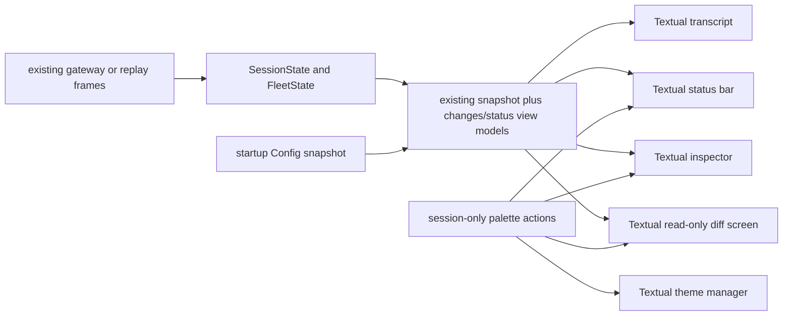
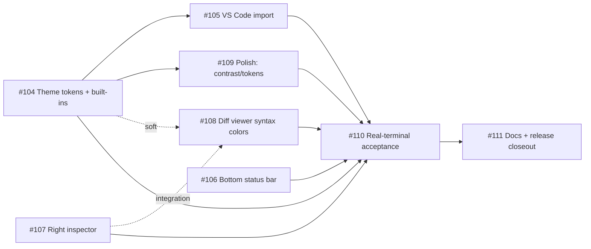

# Talaria v0.5.0 — integrated implementation run plan

## Summary

Deliver the already-approved Talaria v0.5.0 issue graph as one coordinated run: six feature
children, an installed-wheel real-terminal acceptance child, and documentation and release
closeout. This plan fixes the implementation seams, ownership, integration order, and evidence
contract; it does not reopen the scope recorded in parent issue
[infiquetra/talaria#103](https://github.com/infiquetra/talaria/issues/103).

This is a Deep, plan-only Saga artifact minted from the fresh issue handoff. Inline orchestration is
the selected execution shape because one run owner must serialize shared-file integration while the
four named workers retain exclusive child worktrees; this document does not launch implementation,
review, testing, delivery, a pull request, or a release.

## Approved contract and requirement ledger

The issue bodies are the authority for WHAT. The identifiers below provide stable traceability for
HOW; they summarize without adding or dropping product scope.

| ID | Approved requirement | Owning child |
| --- | --- | --- |
| R1 | Refined Default, Dark Green Terminal, Neutral Dark, and Accessible High Contrast; documented tokens, live preview, explicit user/repository save, default → user → repository → session precedence, and visible fallback | [#104](https://github.com/infiquetra/talaria/issues/104) |
| R2 | Bounded Visual Studio Code color-theme JSON import with an exact supported mapping, warnings, deterministic overwrite, and no partial write | [#105](https://github.com/infiquetra/talaria/issues/105) |
| R3 | One configurable, responsive true-bottom status bar with seven named segments and visible closure of the two status-config defects | [#106](https://github.com/infiquetra/talaria/issues/106) |
| R4 | A session-only, keyboard-controlled right inspector with tasks, context, changed files, and operation details from state already held | [#107](https://github.com/infiquetra/talaria/issues/107) |
| R5 | A strictly read-only, bounded diff viewer with side-by-side and unified modes, syntax and intraline treatment, file/hunk navigation, and narrow fallback | [#108](https://github.com/infiquetra/talaria/issues/108) |
| R6 | Height-invariant focus indication, transcript treatment, contrast, non-color signals, reduced motion, and stable scroll | [#109](https://github.com/infiquetra/talaria/issues/109) |
| R7 | Configuration is additive, documented, and restart-to-apply; only picker/session controls change live, and no external-file watcher exists | #104, #106, #109, #111 |
| R8 | The domain remains terminal-framework independent, Textual remains the presentation layer, and block/diff rendering remains bounded by work and height | #104–#109 |
| R9 | Four workers and two testers operate only in exclusive linked worktrees or isolated tester scratch areas; every implementation commit is child-scoped | #103 run contract |
| R10 | Both testers prove the exact installed wheel through pseudo-terminals and live Hermes sessions on the contracted model route, with raw capture, screenshots, and honest failures | [#110](https://github.com/infiquetra/talaria/issues/110) |
| R11 | User docs, migration, install verification, stale-doc repair, changelog, version, tag, and GitHub release run only after acceptance evidence | [#111](https://github.com/infiquetra/talaria/issues/111) |
| R12 | Verification emphasizes working requirements and observed failure modes, not speculative rare cases | #103 run contract |

## Binding boundaries

These constraints apply to every unit and every repair commit:

- ADR-0002 remains binding: `talaria/domain/`, transport, protocol parsing, clocks, commands,
  record/replay, and normalized state never import Textual or another terminal framework.
- ADR-0005 remains binding: Textual 8.2.8 is the presentation layer, and terminal widgets stay
  under `talaria/ui/`.
- ADR-0006 remains binding: diff and transcript blocks are bounded by rendered height and per-update
  work, not merely by the number of top-level objects.
- Configuration files are read at process startup. External edits never live-reload; in-app palette
  actions may update only current-session state until an explicit save, and saved files take effect
  on the next process start.
- Diffs are read-only. No edit, stage, revert, apply, checkout, or write-to-worktree action, command,
  binding, dispatcher call, or hidden helper is permitted.
- The settings surface is the existing Talaria slash-command palette plus documented
  `config.toml`; no full settings application is built.
- Linux work and Linux terminal acceptance are deferred. No unit turns an informational Linux
  result into a v0.5.0 product claim.
- Execution capacity is exactly `talaria-w1`, `talaria-w2`, `talaria-w3`, `talaria-w4`,
  `talaria-t1`, and `talaria-t2`. No extra worker or tester role is assumed.
- Every implementation child uses an isolated linked Git worktree under one worker's exclusive
  custody and never edits the shared main checkout. Testers never reuse the operator's real
  `~/.talaria`.
- Commits contain one child issue only. Shared integration is still child-scoped; there is no
  omnibus “resolve v0.5 conflicts” commit.
- Parent issue #103 explicitly forbids launching implementation, review, testing, or delivery until
  the operator launches the run. This plan is preparation, not launch authority.

## Repository grounding

The plan uses current repository structure rather than the issue bodies' illustrative path guesses.

| Existing surface | Implementation consequence |
| --- | --- |
| `talaria/config.py:49-74` declares defaults and scalar environment mappings; `talaria/config.py:220-247` merges default, user, repository, environment, and command-line layers into an immutable snapshot. | Add one normalization-and-notice pass after merging. Do not create a second config loader or add environment aliases for the new theme, bar, or motion settings. |
| `talaria/ui/app.py:1115-1146` is the global binding registry; `talaria/domain/commands.py:352-480` is the Talaria-local slash-command registry. | New global and palette paths are registered once in these two places, with screen-local keys kept inside their owning UI surface. |
| `talaria/ui/app.py:1515-1539` currently composes the body, composer, `NeedsYouBar`, then `HelpBar`; `StatusRegion` is inside the body. | One canonical final compose order is defined below and applied serially, not rediscovered by each lane. |
| `talaria/ui/palette.py:186` defines the existing `PaletteRegion` inside the body. | Theme selection extends that region with a theme-picker mode, as issue #104 requires; preview and selection keys stay inside the palette rather than entering the composer or a modal dialog. |
| `talaria/ui/app.py:2013-2058` serializes projection and region updates; `talaria/domain/projection.py:362-370` exposes transcript, subagents, prompts, status, and change labels. | New status/inspector view models are computed once per render boundary and passed down; widgets do not read transport objects. |
| `talaria/domain/state.py:1945-2000` already records tool context and strips/stores `tool.complete.inline_diff` as transcript content. | Inspector and diff data are projected from recorded entries; no gateway method, file scan, Git subprocess, or polling loop is added. |
| `talaria/domain/projection.py:327-358` already carries connection, session, turn, prompt, subagent, and token-usage facts. | Status segments reuse this payload plus held fleet/model state and process-start cwd/branch facts. Missing facts render as unknown or are omitted; they are never fetched. |
| `talaria/ui/status_region.py:34-125` preserves the bounded, literal, ANSI-defanged shell-command result and its categorical marker. | `StatusRegion` remains inside the main body and keeps its runner contract; it does not become the true-bottom bar. |
| `talaria/ui/transcript.py:112-123`, `talaria/ui/transcript.py:827-858`, and `talaria/ui/transcript.py:1721-1744` implement the existing mounted-height/work bounds and follow/anchor behavior. | The diff viewer copies the bounded-window pattern, while polish extends the existing identity/offset anchor rather than inventing a second scroll model. |
| `docs/engineering-journal/DECISIONS.md:1187-1189` places the caret marker in the status region; `docs/engineering-journal/QUEUED.md:1293-1306`, `:1355-1366`, and `:1152-1166` record the open focus and status defects. | #109 uses a fixed-height status-region focus marker; #106 supplies visible startup notices and integer bounds. The prior decisions are completed, not reopened. |
| `tests/test_config.py`, `tests/ui/conftest.py`, `tests/ui/test_dialog.py`, `tests/ui/test_status_region.py`, `tests/ui/test_transcript_bounds.py`, and `tests/ui/test_a4_function_key_row.py` are the current test patterns. | Add focused unit and Pilot tests beside these files. Do not create a parallel test framework just because the issues used the shorthand `tests/config/`. |

## Target architecture

The domain-to-presentation path stays one-way. New projection code is plain Python; only the final
widgets and Textual messages live in `talaria/ui/`.



### Canonical final compose order

All lanes implement against this final tree. The shared-surface lease later in this plan ensures only
one child edits the tree at a time.

```text
TalariaApp Screen (vertical)
├── MainAndInspector (height: 1fr)
│   ├── #body
│   │   ├── TranscriptPane
│   │   ├── AgentRows
│   │   ├── PromptRegion
│   │   ├── PaletteRegion
│   │   └── StatusRegion        shell-command output, seam rows, focus marker
│   └── Inspector              docked only when eligible
├── Composer
├── HelpBar                     documented adjacent key-hint row
└── BottomStatusBar             exactly one row and the true last screen row
```

`NeedsYouBar` no longer owns a separate row: its formatter and queue source feed the
`task_progress` status segment. This keeps the queue visible by default, preserves a fixed one-row
summary, and avoids having two configurable-looking bottom rows.

`HelpBar` remains the child contract's permitted documented adjacent row because it contains key
hints rather than runtime status. `BottomStatusBar` is always last, is always one row, and never
wraps; `StatusRegion` remains inside `#body`, preserving its independent multi-row cap and timer.
Implementation may arrange `MainAndInspector` around the existing body rather than literally
nesting it, but these names, this order, and the resulting geometry remain the merge contract.

### Command and key ownership

The slash-command palette is the reliable primary route on macOS. Function-key or modal aliases are
secondary, and no new priority chord steals an ordinary composer editing key.

| Surface | Primary route | Keys owned only while open | Global alias |
| --- | --- | --- | --- |
| Theme picker | `/theme`; `/theme save [user\|repository]` (user is the save default) | Up/Down preview, Enter accepts for this session and closes, Escape restores the pre-open theme | none |
| Status bar session toggles | `/bar [segment]` | none; the command toggles one known segment in memory and never writes | none |
| Inspector | `/inspector` | section navigation; Shift+Left/Shift+Right resize while docked; Escape closes a narrow overlay | `ctrl+b` toggle |
| Diff viewer | `/diffs` or Enter on an inspector file | `n`/`p` hunk, `N`/`P` file, `f` file list, `s` side-by-side, `u` unified, Escape close | none |

`/bar` is deliberately not `/status`: Hermes already owns `/status`, and Talaria must not shadow a
working gateway command. The four new local command names are rows in
`TALARIA_LOCAL_COMMANDS`; dispatch tests prove they never reach the gateway.

Theme mode is isolated inside `PaletteRegion`. Existing model, profile, session, and needs-you
picker behavior remains unchanged.

### Consolidated configuration schema

This table is the only schema ledger for the run. A lane may implement only the rows assigned to its
child, so independent branches cannot invent competing names or defaults.

| Child | TOML path | Type and default | Validation and fallback | Persistence contract |
| --- | --- | --- | --- | --- |
| #104 | `theme.name` | string, `"refined-default"` | Built-in or stored imported theme name. Unknown/non-string resolves to Refined Default and adds a visible startup note. | User `~/.talaria/config.toml`, repository `./.talaria/config.toml`, then an unsaved in-memory session override. No environment or command-line override. |
| #105 | no `config.toml` key | Imported theme document at `<TALARIA_CONFIG_DIR>/themes/<slug>.json` | Strict JSON theme schema; invalid/empty input writes nothing. Canonical JSON is atomically replaced for the same slug. | User-scope theme library only; source file is never watched. Selection still persists through `theme.name`. |
| #106 | `status.segments` | string array, `["cwd", "git_branch", "agent_model", "context", "task_progress", "connection", "version"]` | Known names only; preserve first occurrence, report and skip unknown or duplicate rows, and fall back to the full default if no known row remains. | File edits apply on restart; `/bar` changes only the running session. |
| #106 | `status.cwd_max_columns` | integer, `24` | Inclusive range 8–48; invalid uses 24 and adds a visible startup note. | Restart-to-apply; layout breakpoints remain fixed. |
| #106 | `status.git_branch_max_columns` | integer, `18` | Inclusive range 8–40; invalid uses 18 and adds a visible startup note. | Restart-to-apply; layout breakpoints remain fixed. |
| #106 | `status.agent_model_max_columns` | integer, `24` | Inclusive range 10–48; invalid uses 24 and adds a visible startup note. | Restart-to-apply; layout breakpoints remain fixed. |
| #106 | `status.command` | existing optional string, `None` | `None` disables it; a non-string, empty, or unparseable value disables only the shell-command region and adds a visible startup note. | Existing restart-to-apply behavior. |
| #106 | `status.interval_seconds` | existing integer, `5` | Inclusive range 1–3600; negative, zero, oversized, or non-integer uses 5 and adds a visible startup note. | Existing restart-to-apply behavior. |
| #107 | no key | panel width, requested collapsed state, automatic narrow state, and overlay state are fields on the running app | Width clamps to 28–48 columns in four-column steps; below 120 columns docking auto-collapses and toggle opens an overlay without changing the requested dock state. | Session only by approved contract; no panel geometry is written. |
| #108 | no key | preferred diff mode is held by the open viewer | Side-by-side is effective at 112 columns or wider; a narrower screen forces unified without overwriting the preference. | Viewer session only. |
| #109 | `ui.reduced_motion` | boolean, `false` | Non-boolean uses false and adds a visible startup note. | Restart-to-apply; no environment alias. |
| #110 | no key | tester isolation uses `TALARIA_CONFIG_DIR` | Each tester points it at a unique scratch directory. | Test harness only, never the operator's real config. |
| #111 | no new key | documents every row above | Examples are parsed in tests or copied exactly from tested fixtures. | Documentation only. |

`load_config` gains an immutable `notices` tuple and a single normalization pass after all configured
layers merge. Invalid values fall back at the winning scope; they do not reveal a weaker-scope value
and therefore cannot make precedence depend on whether a typo happened to exist.

The theme writer is deliberately not a general TOML serializer. It rewrites or appends only the
top-level `[theme]` table, parses before and after, verifies that the semantic change is exactly
`theme.name`, preserves every byte outside that table, and uses a same-directory temporary file plus
atomic replace; the existing credential writer in `talaria/transport/refresh.py:241-301` and
`:451-517` is the pattern, not a dependency from config into transport.

### Theme token vocabulary and Visual Studio Code mapping

The visual specification's [Complete registry](../design/2026-08-30-talaria-v0-5-0-visual-spec.md#complete-registry)
is the sole normative 58-token vocabulary, including exact dotted public names, `$talaria-*`
bridges, Textual compatibility variables, values for all four built-ins, and the twelve transcript
foreground/background channels. U1 implements that registry directly rather than maintaining a
second plan-local copy. The obsolete plan-only `diff_changed` name is not implemented;
`talaria.diff.hunk` and `talaria.diff.hunk.background` carry changed-hunk treatment as specified.

The resolved bottom-bar additions are part of every built-in `ThemeSpec` exactly as follows:

| Talaria token | Semantic role | Textual bridge | Refined Default | Dark Green Terminal | Neutral Dark | Accessible High Contrast |
| --- | --- | --- | --- | --- | --- | --- |
| `talaria.status.success` | Connected and successful-state text in the bottom status bar | `$talaria-status-success` | `#3FB950` | `#6EE7A0` | `#82C99A` | `#63FF90` |
| `talaria.status.warning` | Connecting and reconnecting state text in the bottom status bar | `$talaria-status-warning` | `#D29922` | `#FFD166` | `#E4C07A` | `#FFD75F` |
| `talaria.status.error` | Disconnected and authentication-failed state text in the bottom status bar | `$talaria-status-error` | `#FF7B72` | `#FF7B72` | `#F08C8C` | `#FF6B6B` |
| `talaria.status.attention` | Queue-attention `!N` marker in the bottom status bar | `$talaria-status-attention` | `#58A6FF` | `#39FF88` | `#9AB7D3` | `#00FF85` |

The plan-only `queue_attention` name is retired. The literal `!N` marker uses
`talaria.status.attention`; its glyph and count remain present when color is disabled.

U2 implements the visual specification's [Supported workbench colors](../design/2026-08-30-talaria-v0-5-0-visual-spec.md#supported-workbench-colors)
table verbatim. For a token with multiple candidate keys, the first present valid key in listed
order wins. Supported `tokenColors` scopes use longest matching supported scope prefix, with a later
rule winning only a tie; unsupported keys and scopes are reported rather than inferred.

Input may use `#RGB`, `#RGBA`, `#RRGGBB`, or `#RRGGBBAA`, but stored and runtime values are opaque
uppercase `#RRGGBB`. Alpha input is composited in sRGB against the destination's normative
background; background tokens use their enclosing canvas or panel, falling back to the Refined
Default background when that destination has not mapped yet. The import report names every alpha
composite.

The fallback contract is the specification's exact fourteen fallback-only tokens:
`talaria.secondary`, `talaria.status.muted`, and all twelve transcript foreground/background
tokens. U2 asserts that count and names every fallback; any other missing mapped token is reported
separately.

## Dependency graph and execution capacity

The logical graph is the parent issue's graph, unchanged:



Four primary implementation lanes start exactly as parent #103 declares. #109 is the declared split
polish overlay: its focus/scroll work starts now in a separate worktree, while its token/contrast work
waits for #104.

| Worker | Lane and sequence | Isolated custody | Start/dependency rule |
| --- | --- | --- | --- |
| `talaria-w1` | Lane A: #104, then #105 | A fresh child branch/worktree for #104; a new one for #105 after #104 integrates | Start #104 now; #105 only from the integrated #104 run-branch commit. |
| `talaria-w2` | Lane B: #106; Lane E overlay: #109 | Separate exclusive #106 and #109 worktrees; never mix their indexes or commits | Start #106 now. Seed #109's focus/scroll tests now during #106 review/check waits; rebase its token half after #104 and its bar interactions after #106. |
| `talaria-w3` | Lane C: #107 | Exclusive #107 worktree | Start now. Publish the changed-file selection protocol for #108 before shared wiring. |
| `talaria-w4` | Lane D: #108 | Exclusive #108 worktree | Start now against current Textual variables; rebase for #104 tokens and #107 selection before integration. |
| `talaria-t1` | #110 theme/import/polish acceptance | Own scratch config, pseudo-terminal, capture, and fresh install environment | Prepare harness/corpora now; execute only after #104–#109 are integrated. |
| `talaria-t2` | #110 status/inspector/diff acceptance | Own scratch config, pseudo-terminal, capture, and fresh install environment | Prepare harness/corpora now; execute only after #104–#109 are integrated. |

One worker may hold two linked worktrees but may edit only one at a time. The #109 worktree is not a
branch off #106; its commits remain solely #109 and it rebases onto the integrated prerequisites.

### Shared-surface lease

The highest-risk integration files are `talaria/ui/app.py`, `talaria/domain/commands.py`, and
`talaria/config.py`. Parallel work proceeds in new modules and tests; final wiring follows this
serialized lease:

1. A child first commits its new modules, pure helpers, fixtures, and focused tests without editing
   a stale copy of a shared file.
2. The run owner grants the shared-surface lease to one ready child. No other child edits the three
   shared files until that child integrates.
3. The lease holder rebases onto the current run branch, applies only its rows from the configuration
   table, its commands from the command table, and its adapter in the canonical compose tree.
4. The child runs its focused tests plus shared regression tests, commits the wiring under that child
   issue, and hands the exact commit list to the run owner.
5. The run owner integrates those child commits onto the run branch, reruns the overlap checks, and
   releases the lease. Waiting branches rebase before requesting it.

No worker resolves a conflict by accepting one whole version of `app.py` or `config.py`. The final
tree, command table, and schema table above are the merge specification; a textual conflict is
resolved field by field against them.

## Key Technical Decisions

**KTD1 — New state projections are framework-free and use only state already held.**
`talaria/domain/changes.py` parses stored transcript operations and unified diff bodies into frozen
operation/file/hunk views. Status facts are assembled from the existing status payload, fleet/model
records, and process-start cwd/Git-branch values; no new transport, poll, filesystem scan, or
per-render subprocess exists.

**KTD2 — Theme selection is preview first, and persistence is a separate command.** Highlight
changes in `PaletteRegion` set the Textual theme immediately; Escape restores the theme and session
override held when the picker opened. Enter closes the picker with a session-only choice. Only
`/theme save` writes, targeting user scope by default or repository scope when explicitly chosen.

**KTD3 — Theme files are data, built-ins are Python constants, and imported files are canonical
JSON.** `talaria/themes/builtins.py` keeps all four built-ins in the wheel without package-data
ambiguity. Imported names resolve `--name`, then JSON `name`, then file stem; a validated slug is the
filename, while the display name remains data inside the file.

**KTD4 — Config normalization returns values plus visible startup notes.** Bad optional settings
never crash the whole client and never disappear silently. Notes are injected as local startup
transcript entries on both replay and live launch paths, while syntactically invalid TOML remains a
clear launch error because no safe document boundary exists to recover from.

**KTD5 — The bottom bar absorbs task progress, while help and shell status retain distinct jobs.**
The queue summary moves from `NeedsYouBar` into the default `task_progress` segment; `HelpBar` remains
one documented row above the bar; `StatusRegion` stays bounded inside `#body`. Only
`BottomStatusBar` occupies the last row.

**KTD6 — Palette commands own settings actions; screen keys stay local.** Theme selection and save,
status toggles, inspector fallback, and diff entry remain reachable through slash commands without
stealing composer keys. The inspector also owns the rendered `ctrl+b` global toggle, while diff
navigation keys are active only inside the viewer; #110 still proves real terminal delivery.

**KTD7 — Inspector and diff share one immutable selection protocol.** `ChangedFileView.key` and
`DiffSelection(file_key, hunk_index)` are the handoff. The inspector publishes selection messages;
the app opens a diff screen with the matching held document; neither widget owns or mutates session
state.

**KTD8 — Diff rendering indexes once and windows every render.** Parsing is one linear pass when the
viewer opens. Each update formats at most the viewport height plus ten rows of overscan above and
below; intraline matching runs only for visible paired lines and falls back to whole-line emphasis
above a documented 2,000-cell line cap.

**KTD9 — Narrow layout preserves intent separately from effective state.** Inspector
`requested_collapsed` and diff `preferred_mode` survive a narrow resize in memory, while
`auto_collapsed` and `effective_mode` reflect the current width. Widening restores the operator's
choice without writing config.

**KTD10 — An acceptance receipt is bound to one candidate commit and wheel digest.** A repair creates
a new candidate, invalidates earlier verdicts, rebuilds the wheel, and reruns affected plus smoke
flows. Nobody patches an installed test environment or treats evidence from two candidate hashes as
one pass.

**KTD11 — Documentation and release consume acceptance; they cannot improve its verdict.** #111
links the #110 evidence as observed, including any reserved or failed leg, and cannot relabel a halt
as a pass. Version/tag/release actions happen only after the accepted candidate reaches main under
normal operator authority.

## Implementation Units

The unit identifiers map one-to-one to child issues and never renumber. Harness preparation in U7
may run early, but U7 acceptance execution waits for U1–U6; U8 waits for U7 evidence.

### U1. #104 — theme token foundation, four built-ins, preview, and explicit persistence

**Goal.** Establish the complete token contract, register the four built-ins, add preview/cancel and
explicit persistence targets, and make saved or invalid choices reach a fresh app visibly.

**Requirements.** R1, R7, R8, R12.

**Dependencies.** None. It is Lane A's foundation and must integrate before U2 and the token half of
U6; U5 may prototype against existing Textual variables but rebases before integration.

**Files.** Add `talaria/themes/__init__.py`, `talaria/themes/builtins.py`, and
`talaria/ui/theme.py`. Update `talaria/ui/palette.py`, `talaria/domain/commands.py`,
`talaria/config.py`, `talaria/cli.py`, and `talaria/ui/app.py`.

**Approach.** Define frozen `ThemeSpec` records for Refined Default, Dark Green Terminal, Neutral
Dark, and Accessible High Contrast, plus a `ThemeRegistry` that merges each specification onto
Refined Default, returns the filled-token list, converts the resolved result to a Textual theme, and
registers stable slugs. Apply configured theme and startup notes before the first visible render,
then hold a separate in-memory session selection. Each `ThemeSpec` defines all 58 canonical tokens,
including the four bar-scoped semantic tokens and exact per-theme values in the vocabulary table
above.

Extend `PaletteRegion` with a theme-picker mode. `/theme` captures the open-time selection, app
applies each highlighted row immediately, Escape restores the captured selection, and Enter closes
the mode with an in-memory session selection only. `/theme save` is the separate deliberate write:
it targets user scope by default and repository scope only when explicitly requested.

Implement the surgical `[theme]` writer in `talaria/config.py` with pre/post semantic verification,
atomic replacement, and preserved neighboring bytes. User save targets
`global_config_dir()/config.toml`; repository save targets `cwd/.talaria/config.toml`.

**Reuse.** Reuse `PaletteRegion`'s existing focus, command routing, and cancellation behavior,
`literal_text` for all names and notices, the existing config merge order, and the credential
writer's verify-then-atomic-replace discipline without importing transport into config.

**Tests.** Add `tests/ui/test_theme.py` for four rows, highlight preview, cancel restoration, the
session-only Enter result, explicit user/repository saves, session precedence, startup selection,
the exact 58-token registry and four built-in value sets, every Textual bridge including
`$text-warning` and the four `$talaria-status-*` semantic variables, and missing-token warnings.
Update `tests/ui/test_slash_palette.py` and
`tests/domain/test_commands.py` to prove existing palette modes are unchanged and `/theme` plus its
`save` action are local.

Add `tests/test_config_write.py` for create/replace, comments and sibling-table byte preservation,
user/repository targets, no write while browsing, atomic failure, and a semantic-diff guard. Update
`tests/test_config.py`, `tests/test_cli.py`, and `tests/ui/test_live_wiring.py` for precedence,
unknown/non-string fallback notes, and both launch paths; contrast assertions cover Accessible High
Contrast token pairs.

**Verification.** Run `uv run pytest tests/ui/test_theme.py tests/ui/test_slash_palette.py
tests/test_config.py tests/test_config_write.py tests/test_cli.py -q`, then Ruff, mypy, Bandit, and
`git diff --check` before the shared-surface lease is released.

### U2. #105 — bounded Visual Studio Code theme import

**Goal.** Turn one strict Visual Studio Code color-theme JSON file into one deterministic Talaria
user theme, with the exact mapping and every unsupported or filled token reported.

**Requirements.** R2, R7, R8, R12.

**Dependencies.** U1 integrated. No other feature child depends on U2; U7 acceptance does.

**Files.** Add `talaria/ui/theme_import.py`, `docs/formats/vscode-theme-import.md`, and fixtures under
`tests/fixtures/vscode-themes/`. Update `talaria/cli.py` and `talaria/ui/theme.py`; update
`talaria/domain/commands.py` only if the optional palette import route is implemented after the
required CLI is complete.

**Approach.** Add `talaria theme import <file.json> [--name NAME]` as a nested argparse command. Parse
strict UTF-8 JSON, require an object with a `colors` mapping and/or `tokenColors` list and at least
one supported mapped value, accept only the documented hex forms, and produce a frozen
`ImportReport` containing mapped values, unsupported source entries, fallback tokens, target name,
and target path.

Apply the visual specification's workbench mapping and candidate-key precedence verbatim. Resolve
overlapping `tokenColors` rules by longest supported prefix, then by later document order only for
ties. Composite alpha inputs in sRGB against the specified destination background before building
the theme, store opaque uppercase `#RRGGBB` values only, and list every composite in the report.
The report and tests distinguish the exact fourteen always-fallback tokens from additional mapped
tokens whose sources happen to be absent or invalid.

Resolve the name in the fixed order `--name`, top-level `name`, file stem. Validate a lowercase
hyphenated storage slug with no separators or traversal, render canonical sorted JSON with one
trailing newline, then atomically replace `<config>/themes/<slug>.json`; parsing and the complete
report happen before any directory or file is changed.

The authoritative mapping table in the visual specification is copied verbatim to
`docs/formats/vscode-theme-import.md` and referenced by U8. Do not interpret `include`, icon/product
theme fields, JSON comments, or unmapped TextMate selectors.

**Reuse.** Reuse U1's `ThemeSpec`, resolver, name registry, atomic-write helper, and token fallback;
do not create a second theme model or persistence path.

**Tests.** Add `tests/ui/test_theme_import.py` with a hand-authored representative dark theme, an
unsupported-and-extension-warning fixture, malformed JSON, wrong root/schema, empty input, invalid
colors, name precedence/path safety, deterministic same-name overwrite, and no partial artifact.
Update `tests/test_cli.py` for argv, exit status, stdout/stderr report, and fresh-registry restart.

Assert exact mapped values and warning counts, not merely that an output file exists. Round-trip the
stored JSON through U1's registry and `theme.name` precedence, and keep fixtures small enough for
their expected mapping to be reviewed in one screen. Include counterexamples for first-valid
workbench candidate precedence, `constant.numeric` beating a later broader `constant` rule,
later-rule tie breaking, alpha compositing to the exact opaque value, and the fourteen-token
always-fallback count.

**Verification.** Run `uv run pytest tests/ui/test_theme_import.py tests/test_cli.py -q`, invoke the
built entry point against the representative fixture in a temporary `TALARIA_CONFIG_DIR`, confirm
the second import is byte-identical, then run Ruff, mypy, Bandit, and `git diff --check`.

### U3. #106 — true-bottom responsive status bar and status-config defect closure

**Goal.** Replace the separate task-summary bottom row with one configurable last-row status bar,
keep HelpBar and shell-command status honest, and surface every invalid status setting visibly.

**Requirements.** R3, R7, R8, R12.

**Dependencies.** None for structure. U1 is a soft dependency only for final token names, handled by
rebase before integration.

**Files.** Add `talaria/ui/status_bar.py`. Update `talaria/ui/app.py`,
`talaria/ui/status_region.py`, `talaria/ui/needs_you.py`, `talaria/status/contract.py`,
`talaria/config.py`, `talaria/cli.py`, and `talaria/domain/commands.py`.

**Approach.** Define one immutable `BottomStatusBarView` assembled at the app render boundary and
seven `SegmentSpec` records with full/compact/minimum renderers, maximum cell budgets, and the visual
specification's fixed priorities: version 0, cwd 10, Git branch 20, context 40, agent/model 50, task
progress 80, connection 100. Lower values drop first; connection is never deliberately dropped.
Display order remains exactly the configured order; priority controls truncation/drop only.

Capture cwd and Git branch once at launch from local process state, never per render. Use the
existing status payload for connection/turn/usage, held model/fleet state for agent/model and task
progress, and `talaria.__version__`; absent values render a compact `?` or an honest text label rather
than causing a fetch.

Render connected state through `talaria.status.success`, connecting and reconnecting through
`talaria.status.warning`, and disconnected and authentication-failed state through
`talaria.status.error`. Render only the literal `!N` portion of `task_progress` through
`talaria.status.attention`. These bar-scoped tokens sit on `talaria.status.background`; do not reuse
the canvas-scoped `talaria.success`, `talaria.warning`, or `talaria.error`. Preserve `[ok]`, `[..]`,
`[~]`, `[x]`, `[!]`, and `!N` so no state depends on color alone.

Implement the visual specification's fixed bands verbatim: all seven use full forms at 144 and
wider; all seven use compact forms from 120–143; version drops from 112–119 and remains absent at
96–111; cwd also drops at 80–95; Git branch at 64–79; context at 48–63; agent/model at 32–47; task
progress at 20–31; below 20 only the minimum connection form survives. Within each band, apply the
specified full-to-compact-to-minimum truncation before priority-based drop. The three configurable
maximums cap cwd, Git branch, and agent/model values but never move a breakpoint. The widget has
`height: 1`, `overflow: hidden`, and a Pilot invariant that its rendered height is always one.
Render that view through the canonical `BottomStatusBar` widget.

Move the existing needs-you summary formatter into `task_progress`, remove `NeedsYouBar` from
compose, retain HelpBar above the new last row, and leave `StatusRegion` in the main pane. Add
`/bar` session toggles without writes; unknown command arguments and unknown configured segments
produce notices.

Extend status parsing to return a reason as well as an optional argv, preserve the existing runner
caps, process group, timer, stderr, and ANSI-defanged output, and pass config normalization notices
into the app on live and replay paths. Invalid interval or width-cap values use the schema defaults
and identify both the bad key and fallback.

**Reuse.** Reuse `StatusPayload`, the needs-you queue formatter, `literal_text`, Textual cell-width
measurement, and all `StatusRunner` behavior. Do not duplicate status command execution inside the
new bar.

**Tests.** Add `tests/ui/test_status_bar.py` for all seven segments, configured order, hiding,
duplicates/unknowns, the exact fixed priorities, truncation before drop, and the complete transition
walk at 144, 143, 120, 119, 112, 111, 96, 95, 80, 79, 64, 63, 48, 47, 32, 31, 20, and 19
columns, plus exact connection/attention token assignment with every redundant ASCII form,
arbitrary resizes, literal hostile values, and one-row height. Update
`tests/ui/test_needs_you.py` and
`tests/ui/test_a4_function_key_row.py` for the migrated summary and final bottom-row pins; keep the
existing `#body` queries in `tests/ui/test_needs_you.py` and `tests/ui/test_status_region.py` passing
against the canonical compose identifiers.

Update `tests/test_config.py`, `tests/test_cli.py`, `tests/status/test_runner.py`, and
`tests/ui/test_status_region.py` for malformed `status.command`, negative/zero/3601 interval,
width-cap type/range validation, visible startup notes, and unchanged shell-command
timer/cap/failure behavior. Each fallback test includes a counterexample with a valid value so it
cannot pass by always using defaults.

**Verification.** Run `uv run pytest tests/ui/test_status_bar.py tests/ui/test_status_region.py
tests/ui/test_needs_you.py tests/test_config.py tests/test_cli.py tests/status -q`, then the quality
checks and `git diff --check`.

### U4. #107 — right inspector from existing runtime state

**Goal.** Add a keyboard-controlled, responsive inspector whose four sections are honest projections
of state already held and whose changed-file selection is the sole entry seam for U5.

**Requirements.** R4, R8, R12.

**Dependencies.** None for development. Its published selection types are an integration dependency
for U5; compose wiring uses the shared lease.

**Files.** Add `talaria/domain/changes.py`, `talaria/ui/inspector.py`, and
`tests/domain/test_changes.py`. Update `talaria/ui/app.py`, `talaria/domain/commands.py`, and
`tests/domain/test_boundary.py` only as needed to include the new domain module in the existing
framework-import check.

**Approach.** Parse the existing entry-scoped transcript into frozen `OperationView`,
`ChangedFileView`, `DiffDocument`, and `DiffSelection` values. Recognize only stored unified-diff
headers and the already-normalized tool rows; a line that cannot be classified remains literal
operation detail and does not invent a file.

Build `InspectorView` at the same serialized render boundary as the transcript. Tasks come from the
needs-you queue and agent rows, context from focused session/profile/endpoint/model and existing
usage, changed files from `DiffDocument`, and operation details from the selected held operation;
empty sections say what has not been observed.

The panel width starts at 36 columns, clamps 28–48 in steps of four, and stays in app memory.
`requested_collapsed` records `ctrl+b` or `/inspector`; `auto_collapsed` applies below 120 screen
columns without overwriting that request. Crossing 120 to 119 collapses a docked panel, and returning
to 120 restores only a panel that the operator had left open.

Below 120, toggle opens a right overlay without reflowing or resizing the transcript. From 32–119
columns its width is `min(saved width, terminal width - 2)`; below 32 it occupies the terminal width.
The existing border title includes `[overlay]`, and Escape closes it and restores prior focus.

**Reuse.** Reuse `entry_scoped_view`, `fleet_queue`, current model/profile records, and Textual
messages. No `Path.rglob`, Git invocation, watcher, RPC method, or timer is introduced.

**Tests.** Add `tests/domain/test_changes.py` using real `tool.start`/`tool.complete.inline_diff`
event shapes to prove file/hunk identity and literal unknown details. Add
`tests/ui/test_inspector.py` for `ctrl+b` and `/inspector`, open/collapse, 28/48 resize bounds,
119/120-column transitions, restoration of requested state, narrow overlay geometry and no-reflow
behavior, Escape focus restoration, all four seeded sections, honest empty states, selection
messages, and no transport/dispatcher calls.

Run existing transcript and agent-row tests with the panel both present and collapsed. The domain
boundary test must fail if `talaria/domain/changes.py` imports Textual.

**Verification.** Run `uv run pytest tests/domain/test_changes.py tests/domain/test_boundary.py
tests/ui/test_inspector.py tests/ui/test_transcript_bounds.py tests/ui/test_agent_rows.py -q`, then
the quality checks and `git diff --check`.

### U5. #108 — bounded, read-only diff viewer

**Goal.** Render only the session-reported diff set in side-by-side or unified form, with syntax and
intraline treatment, bounded navigation, and no mutation surface.

**Requirements.** R5, R8, R12.

**Dependencies.** U4's selection protocol for final integration; U1's tokens are a soft dependency
for final color wiring. Development begins immediately and rebases onto both before integration.

**Files.** Add `talaria/ui/diff_viewer.py`, `tests/ui/test_diff_viewer.py`, and fixtures under
`tests/fixtures/diffs/`. Update `talaria/ui/inspector.py`, `talaria/ui/app.py`, and
`talaria/domain/commands.py`; add Pygments as an explicit direct dependency in `pyproject.toml` and
refresh `uv.lock` because production code must not rely on an undeclared transitive dependency.

**Approach.** Consume U4's `DiffDocument`; do not open repository files or run Git. Index files and
hunks once, retain a preferred mode, force unified below 112 columns, and render a viewport window
plus ten rows of overscan on each side.

Pair deletion/addition runs within one hunk and use a bounded sequence comparison to mark changed
spans. Lines above 2,000 terminal cells receive whole-line change treatment, satisfying the approved
pathological-line non-goal without unbounded comparison work.

Use Pygments lexer selection from a small documented extension map, fall back to plain text for an
unknown extension, then translate token classes through U1's syntax tokens. Intraline spans are
applied after syntax spans so changed text remains perceivable in both Refined Default and Accessible
High Contrast.

Open the modal from `/diffs` or an inspector selection. Modal-local `n`/`p` navigation updates the
hunk index, `N`/`P` updates the file index, `f` opens the file projection, `u` selects unified, and
`s` requests side-by-side. Below 112, `s` leaves unified active and writes the refusal into the
existing header row without adding height. There is no dispatcher, subprocess, filesystem writer,
or writable text control.

**Reuse.** Reuse `PickerDialog` for the jump-to-file list, U4's immutable selection messages,
`literal_text` at every path/content boundary, and the transcript's window/anchor concepts without
sharing mutable widget state.

**Tests.** Add `tests/ui/test_diff_viewer.py` for unified and side-by-side rendering, 111/112-column
effective mode, restoration of preferred mode, exact `n`/`p` hunk and `N`/`P` file navigation, file
picker, below-threshold header refusal, intraline spans, unknown-language fallback, two themes,
hostile filenames/content, and honest no-diff state.

The large fixture asserts rendered rows are bounded by viewport plus overscan and that intraline work
counts only visible pairs. An AST/keymap/command-table test rejects edit, stage, revert, apply,
checkout, filesystem-write, subprocess, and dispatcher paths; it proves the hard read-only boundary
rather than trusting labels.

**Verification.** Run `uv run pytest tests/ui/test_diff_viewer.py tests/ui/test_inspector.py
tests/domain/test_changes.py -q`, then the quality checks and `git diff --check`.

### U6. #109 — interaction and readability polish

**Goal.** Make focus, transcript kinds, status, and scroll position legible without layout movement,
color-only meaning, or mandatory motion across all four themes.

**Requirements.** R6, R7, R8, R12.

**Dependencies.** The caret/focus and scroll tests start now. Contrast, transcript tokens, and
theme-driven signals wait for U1; task-progress and status focus integration rebases onto U3.

**Files.** Update `talaria/ui/focus.py`, `talaria/ui/composer.py`,
`talaria/ui/transcript.py`, `talaria/ui/status_region.py`, `talaria/ui/app.py`,
`talaria/ui/agents.py`, `talaria/ui/needs_you.py`, `talaria/ui/theme.py`,
`talaria/themes/builtins.py`, and `talaria/config.py`. Add
`tests/ui/test_focus_indication.py` and `tests/ui/test_motion.py`.

**Approach.** Give `StatusRegion` a dedicated, always-mounted one-row focus marker independent of
the shell result marker. It renders `caret: composer`, `caret: transcript`, `caret: prompts`,
`caret: inspector`, or the actual focused region; focus changes update text/token only and never
mount, remove, or resize a widget.

Apply transcript kind styles through the six canonical `talaria.transcript.*` marker/background
pairs while retaining existing block factories, entry identity, spacing bounds, and raw content. Add
a glyph or word to connection, agent lifecycle, and queue-attention renderers so tests can
distinguish every state after all colors are normalized to one value.

Introduce one `MotionPolicy` from `ui.reduced_motion`. Widgets route nonessential spinner frames and
any scroll transition through it; reduced mode uses static progress text and zero-duration scrolling,
while content/coalescing timers remain untouched because they are correctness mechanisms, not visual
animation.

Extend the transcript's existing identity-plus-offset anchor around append, terminal resize, and
`StatusRegion` height changes. When follow is true, settle at the new bottom; when false, restore the
same top visible entry and cell offset after layout.

Audit all rendered foreground/background pairs in the four built-ins with one contrast helper. Every
ordinary-text pair targets at least 4.5:1 and every focus boundary or large/bold pair at least 3:1;
Accessible High Contrast permits no lower decorative/muted exception and therefore meets Web Content
Accessibility Guidelines (WCAG) AA across its complete token-pair matrix.

The same helper covers each bar-scoped semantic token against `talaria.status.background` in every
built-in theme. The automated contrast test asserts all sixteen pairs at 4.5:1 or higher and checks
the specification's exact ratios in theme order: success 5.77/13.15/9.85/16.24, warning
5.80/14.08/11.09/15.14, error 5.81/8.05/8.08/7.57, and attention
5.80/15.31/9.23/15.64.

**Reuse.** Complete the recorded status-region caret decision, use the existing `CaretReleased`
events and transcript anchor, and keep the ADR-0006 block renderer unchanged.

**Tests.** `tests/ui/test_focus_indication.py` records all widget heights before and after focus moves
and asserts marker text/glyph as well as color. `tests/ui/test_motion.py` proves reduced mode freezes
nonessential progress and makes every routed scroll instantaneous while ordinary mode retains the
existing behavior.

Update `tests/ui/test_transcript_blocks.py`, `tests/ui/test_transcript_bounds.py`,
`tests/ui/test_kind_styles.py`, `tests/ui/test_agent_rows.py`, `tests/ui/test_needs_you.py`,
`tests/ui/test_status_bar.py`, `tests/ui/test_theme.py`, and `tests/test_config.py` for append/resize/
status-update anchors, follow-bottom boundary behavior, token-only styles, the sixteen bar-token
contrast pairs, non-color states, and restart-only reduced motion.

**Verification.** Run `uv run pytest tests/ui/test_focus_indication.py tests/ui/test_motion.py
tests/ui/test_transcript_bounds.py tests/ui/test_kind_styles.py tests/ui/test_agent_rows.py
tests/ui/test_needs_you.py tests/ui/test_theme.py tests/test_config.py -q`, then the quality checks and
`git diff --check`.

### U7. #110 — installed-wheel pseudo-terminal and live Hermes acceptance

**Goal.** Produce repeatable, per-tester evidence that one exact candidate wheel works through real
terminal input, resizing, restart, live traffic, and ordinary failure paths.

**Requirements.** R10, R12 and the observed acceptance of R1–R9.

**Dependencies.** Harness preparation has none and runs in parallel. Execution begins only after
U1–U6 are integrated on the run branch and the exact candidate passes project checks.

**Files.** Add `scripts/acceptance/v050_install_probe.py`,
`scripts/acceptance/v050_pty_driver.py`, `tests/acceptance/test_v050_harness.py`, replay fixtures
under `tests/fixtures/acceptance/`,
`docs/plans/2026-08-30-talaria-v0-5-0-acceptance-checklist.md`,
`docs/plans/2026-08-30-talaria-v0-5-0-live-acceptance-results.md`, and a sanitized artifact manifest
under `docs/acceptance/v0.5.0/`.

**Approach.** Build the wheel from the run branch, record commit, wheel filename, and SHA-256 digest,
then give each tester a distinct fresh virtual environment and scratch `TALARIA_CONFIG_DIR`. Probes
invoke only that environment's `talaria --version`, bare launch, and `talaria gate`; receipts record
the resolved executable path so checkout/global leakage is visible.

The pseudo-terminal driver accepts executable, config directory, dimensions, replay/live argv, timed
key sequence, expected literal observations, raw ANSI capture path, and timeout. It supports resize
events and process kill without mocking subprocess or terminal byte flow; its own tests run against a
small echo terminal before it drives Talaria.

Deterministic UI flows use replay fixtures. Each tester also runs one throwaway live Hermes session
end to end on OpenCode Muse Spark 1.2 Contributor Free; only primary unavailability, connection
failure, not-found, or bounded-test incompletion permits one rerun on Ollama GLM 5.3 Flash, with the
triggering reason recorded. No other or silent substitution passes.

Raw captures stay in each scratch area until reviewed for credentials and private identifiers. The
committed evidence set contains only sanitized ANSI text, terminal screenshots, a manifest with
paths/hashes/model route/fallback reason, and the results document; an unsafe artifact is withheld
and the leg remains unproved rather than being committed.

No Computer Use is used. A checklist step explicitly reserved for the operator remains marked
reserved; testers do not simulate it or convert it to a pass.

**Reuse.** Model the checklist and honest-halt language on
`docs/plans/2026-08-19-v0-4-live-acceptance-results.md`; reuse existing replay, gate, credential, and
redaction behavior rather than building a test-only app.

**Tests.** `tests/acceptance/test_v050_harness.py` exercises executable provenance, isolated config,
raw-byte key delivery, resize, timeout, kill, capture hashing, model-route validation, forbidden
substitution, and redaction refusal. Both testers independently run install/restart/failure smoke
flows in addition to their assigned feature track.

**Verification.** Run the harness unit test and full project check, then execute every checklist row
against the candidate wheel. A row passes only with a verdict, capture, screenshot, candidate SHA,
wheel digest, tester name, and model route where live; a hang, blank, missing artifact, or silent
fallback fails or halts it visibly.

### U8. #111 — documentation, migration, install verification, and release closeout

**Goal.** Document exactly what U1–U7 shipped and observed, repair the named stale repository text,
bump the single version source, and close the release only after accepted evidence.

**Requirements.** R7, R11, R12.

**Dependencies.** U7 evidence merged into the run branch. Feature behavior is frozen; a behavior
defect returns to its owning child rather than being repaired in U8.

**Files.** Add or update `docs/themes.md`, `docs/configuration.md`, `docs/terminal-ui.md`,
`docs/install.md`, `docs/releases/v0.5.0.md`, `README.md`, `CLAUDE.md`, `CHANGELOG.md`,
`docs/engineering-journal/QUEUED.md`, and `docs/engineering-journal/DECISIONS.md`. Bump
`talaria/__init__.py` to `0.5.0`; retain the dynamic version declaration in `pyproject.toml` and
update `tests/test_packaging.py` only if the current single-source assertions need a v0.5 artifact
check.

**Approach.** Link the exact import mapping rather than re-derive it. Document every schema row and
default, explicit `[theme]` table-only writes, additive compatibility with old configs, the four
theme scopes, session-only inspector/diff state, read-only diff boundary, and restart-to-apply/no
external-live-reload behavior with copy-pasteable TOML parsed by a test.

Use U7's exact post-install commands and evidence link. Refresh the README v0.1 banner, every stale
ADR-0005 `proposed` reference, the closed block-markdown queue item, and closed v0.5 queue items
without rewriting historical release notes or closing v0.4 acceptance debt.

Write the changelog and release notes from merged behavior and observed evidence. After the run
branch is reviewed and merged through normal authority, rerun the full project check on main, create
annotated tag `v0.5.0`, publish the GitHub release, and verify it; those external actions are not
authorized merely by this plan.

**Reuse.** Follow `docs/releases/v0.4.0.md` for honest limitation language and
`tests/test_packaging.py` for the one-source version contract.

**Tests.** Add a small documentation example test only if no existing parser covers the TOML
snippets; otherwise parse examples in `tests/test_config.py`. Run link checks if the repository has
one by then, `tests/test_packaging.py`, the complete Python suite, and `git diff --check`.

**Verification.** Before tag/release, run the full project check on main and repeat U7's install
probes from the released wheel. Verify `gh release view v0.5.0 --repo infiquetra/talaria` shows notes
linking the U7 evidence and the same accepted commit lineage.

## Integration order and the unmerged candidate

The run branch is an integration branch that has not been merged to shared main. It is the only tree
from which candidate wheels are built.

1. Create the run branch from the operator-selected base and record its commit. Create the five
   feature worktrees (#104, #106, #107, #108, #109); create #105 from the integrated #104 commit.
2. Develop U1, U3, U4, U5, and U6's independent portion in parallel; prepare U7's harness in tester
   scratch areas and its own child branch without executing acceptance.
3. Integrate child branches through the shared-surface lease in deterministic order: **#104, #105,
   #106, #107, #108, #109**. The order satisfies #104 → #105, makes U4's selection available before
   U5 wiring, and lets U6 consume both theme and final chrome contracts.
4. Before each integration, rebase the child onto the current run branch, run focused and overlap
   tests, and integrate only its child-scoped commits. Record child issue, old/new run commit, commit
   list, checks, and lease release in the run log.
5. After #109, run the complete project check on the run branch. Build an **unmerged integrated
   candidate** wheel, hash it, and freeze the commit/digest pair for U7.
6. Install that wheel independently for `talaria-t1` and `talaria-t2`; never run acceptance from the
   checkout, an editable install, or a global executable.
7. Route a failure to the child that owns the observable requirement. Make the repair in that
   child's exclusive worktree as another child-scoped commit, re-integrate it, rerun the complete
   check, build a new digest, and invalidate all receipts that used the old candidate.
8. Integrate U7 harness/evidence only when its receipt matrix is complete and honest. Start and
   integrate U8 last; merge to main, tag, and publish only through the normal post-review operator
   workflow.

No acceptance-only patch is applied inside either tester environment. An integration defect spanning
two children is assigned to the later child whose adapter creates the failure; if ownership is truly
indeterminate, the run owner records it before choosing one child, but still does not create a
cross-child commit.

## Per-child mapping to #110 real-terminal flows

Unit tests establish contracts; U7 proves the human-visible paths through terminal bytes. Every row
below appears in the U7 checklist and evidence manifest.

| Child | Tester and flow | Required observation |
| --- | --- | --- |
| #104 | `talaria-t1`: `/theme`, move highlight, cancel, choose the session theme, run `/theme save` for user and explicit repository targets, restart, then configure an unknown theme | Preview changes immediately; cancel restores; browse/session choice writes nothing; explicit save writes only `[theme]`; restart selects the saved winner; unknown name starts in Refined Default with a visible note. |
| #105 | `talaria-t1`: import representative JSON through installed CLI, inspect warning report, restart and select it; repeat malformed import | Exact mapped theme appears and persists; unsupported and extension fallbacks are listed; same-name import is deterministic; malformed input exits clearly with no artifact. |
| #106 | `talaria-t2`: reorder/hide segments, restart, `/bar` toggle, resize through 144, 143, 120, 119, 112, 111, 96, 95, 80, 79, 64, 63, 48, 47, 32, 31, 20, and 19 columns, observe status cadence, then start with a malformed command, invalid interval, and invalid width caps | Config order/hide applies only after restart; session toggle is immediate and unsaved; bar remains one row and drops in the specified priority order; shell status retains cadence/caps; bad values name fallback instead of blanking or hanging. |
| #107 | `talaria-t2`: use `ctrl+b` and `/inspector`, resize past both clamps, cross 120→119→120, exercise the narrow overlay, select a seeded changed file, and open an empty replay | Requested dock state restores within the session but not after restart; the overlay does not reflow the transcript and Escape restores focus; four sections reflect held state; empty sections say so; no network or file scan occurs. |
| #108 | `talaria-t2`: enter from inspector and `/diffs`, switch modes, navigate with `n`/`p` and `N`/`P`, resize below/above 112, use two themes | Wide default is side-by-side, narrow effective mode is unified and restores preference, navigation stays within held files, large fixture remains responsive/bounded, and no mutation command or key exists. |
| #109 | `talaria-t1`: move focus among composer/transcript/prompt/inspector, answer a real approval with its documented keys, stream and resize while scrolled, follow bottom, restart with reduced motion, inspect all themes | Palette, focus, and approval keys reach the intended control; focus marker changes without any widget-height delta; reading anchor remains stable; follow bottom is predictable; reduced motion is static; transcript kinds and all attention states remain distinguishable without color; High Contrast meets its visual target. |
| #110 | both testers: fresh-wheel probes, deterministic assigned track, one live throwaway session, restart and bad-config/dead-credential/malformed-status/killed-session failures | Executable and wheel provenance match; every flow has raw capture, screenshot, verdict, and model route; failures are visible and bounded; fallback is only the named model for a permitted, recorded reason. |
| #111 | both testers' accepted receipts feed install docs and release notes; post-closeout wheel probes repeat U7 commands | Documentation commands match commands already observed to work; release notes link—not reinterpret—the evidence; released `talaria --version` is `0.5.0`. |

The restart semantics flow deliberately edits a scratch config while Talaria is running and observes
no change, then restarts and observes the change. That proves the required absence of external-file
live reload without adding a watcher solely to test that none exists.

## Saga Code Review lenses

Each child receives focused review before integration, and the assembled candidate receives one
review roster with exactly these seven lenses. An actionable finding blocks its child or candidate;
a passing suite alone does not waive review.

| Lens | What the reviewer must look for |
| --- | --- |
| Architecture | ADR-0002 import boundary; Textual confined to presentation; existing-state-only status/inspector/diff sources; one canonical compose tree; no gateway/file-scan/poll creep; ADR-0006 work and height bounds. |
| Correctness | Theme preview rollback and four-scope precedence; table-only writes; deterministic import; responsive order/priority; session versus auto panel state; diff mode/navigation; stable anchors; new-candidate invalidation after repairs. |
| Security | Literal rendering of imported names, paths, diff/status/tool text; safe slug/path boundary; no partial/config cross-table write; no credential leakage in captures; status runner contract unchanged; no diff mutation or unsafe subprocess path. |
| Testing | Behavior-driving unit/Pilot tests with meaningful counterexamples; real subprocess and pseudo-terminal bytes where those are the behavior; bounds that fail when windowing is removed; explicit no-write/no-dispatch assertions; both tester tracks and failure receipts. |
| API/config contract | Consolidated key names, defaults, ranges, precedence, immutable notices, restart-only behavior, imported-theme storage schema, CLI exit/report shape, and backward-compatible additive config. No lane-private alias or hidden setting. |
| Terminal usability/accessibility | One true bottom row; narrow layouts; real key delivery and palette fallback; focus with no height movement; visible non-color states; WCAG contrast; reduced motion; stable scroll; honest unknown/empty/error states. |
| Documentation | Exact mapping and config tables; explicit save and restart semantics; read-only boundary; macOS-supported/Linux-deferred claim; tested install commands; fixed stale banner/ADR/queue text; acceptance link and honest release limitations. |

Review probes behavior rather than only reading intent. Examples include deleting preview restoration,
removing one config bound, forcing one color for every status, enabling a forbidden diff action, or
disabling viewport clipping and observing the named test fail; mutations are restored before the
child check is recorded.

## Whole-run verification

After each child, run its focused commands from the unit. Before freezing U7's candidate and again
before U8's tag, run the repository contract from the integrated tree:

```bash
uv sync --all-groups
uv run ruff check .
uv run mypy
uv run pytest
uv run bandit -r talaria -q
git diff --check
```

No unit is expected to touch `src/`; if one does, stop and return the change to scope rather than
silently adding a Node implementation. The TypeScript recorder equivalence continues to run through
the Python suite and remains untouched.

U7 additionally builds, hashes, installs, and probes the exact candidate:

```bash
uv build
python3 -m venv /tmp/talaria-v050-t1
/tmp/talaria-v050-t1/bin/pip install dist/talaria-0.5.0-py3-none-any.whl
/tmp/talaria-v050-t1/bin/talaria --version
/tmp/talaria-v050-t1/bin/talaria gate --deltas 5000 --json /tmp/talaria-v050-t1/gate.json
```

The real run uses separate randomly created directories for both testers rather than reusing the
illustrative path. The evidence manifest records the actual paths only after removing private host
details.

## Open questions for the operator

None. The approved issue graph, accepted architecture records, current repository structure, and
existing decision journal were sufficient to make the implementation and integration plan
decision-complete.

## Self-confidence check

- Every approved child #104–#111 maps to exactly one stable implementation unit with concrete files,
  tests, dependencies, and verification.
- The parent graph is reproduced without new edges that change scope; integration ordering is
  explicitly separate from logical dependency.
- The four primary lanes, split #109 timing, four workers, two testers, exclusive worktrees,
  child-scoped commits, and no-shared-main rule are explicit.
- The three shared surfaces have one final compose tree, one command/key table, one config schema,
  and one serialized lease rather than conflict-resolution by convention.
- The unmerged candidate has an exact assembly, provenance, failure-routing, rebuild, and receipt
  invalidation contract before any release action.
- Every #110 flow maps back to its owning child and requires observed terminal evidence, including
  ordinary failures and the exact primary/fallback model rule.
- The seven required review lenses are complete and no eighth lens or speculative product feature
  was added.
