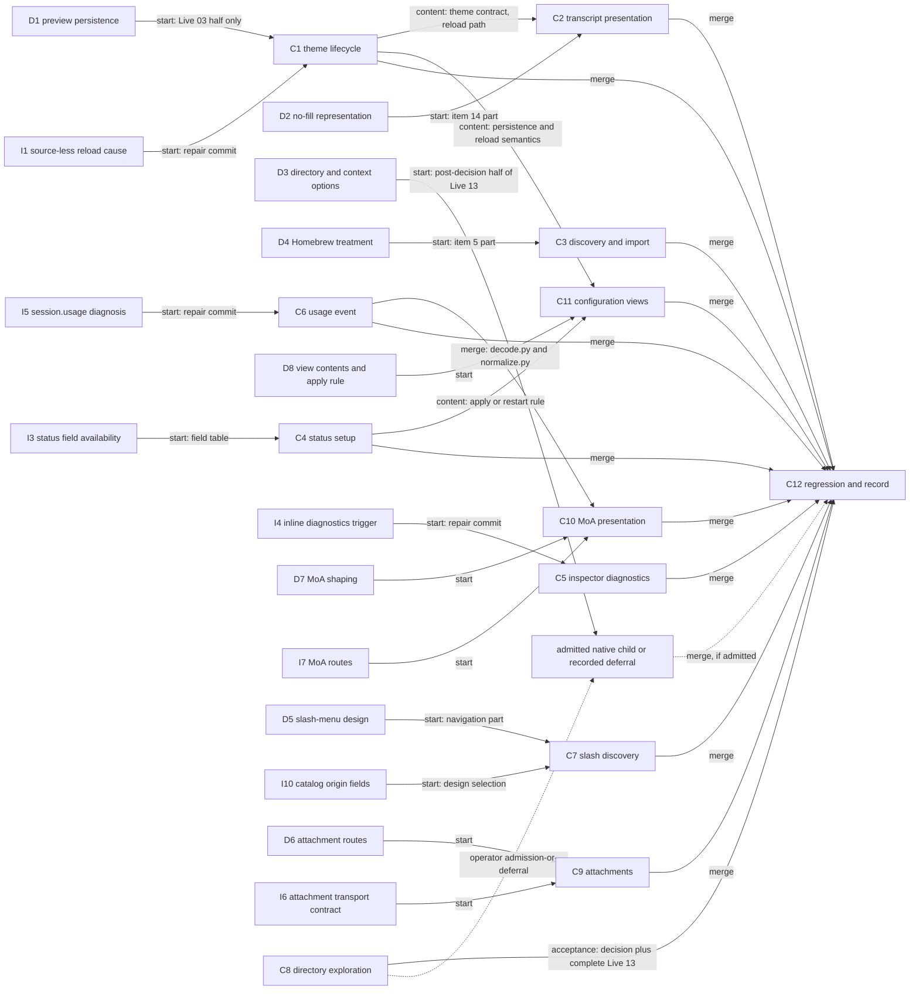

# Talaria v0.6.1 — integrated implementation plan

## Summary

Deliver the twelve retained children of parent issue
[infiquetra/talaria#139](https://github.com/infiquetra/talaria/issues/139) as one coordinated run
with three concurrent workers, five serialized review waves, and one integrated acceptance record.
This plan fixes lane assignment, shared-file custody, the real dependency graph with a gate type on
every edge, the review-wave topology, the earliest operator-usable integrated build, and the
per-child acceptance contract with all 21 live tests. It does not reopen the scope, the requirement
ledger, or the live-test ledger recorded on the parent; those issue bodies remain the authority for
what is built. This plan is the authority for how the run is sequenced.

The plan is a planning output. It launches nothing: no worker is dispatched, no branch is created,
no pull request is opened, and no release, tag, or publication action is taken by this document.
Dispatch waits for the delivery goal and the per-run inputs the parent leaves to the operator.

## Base revision and current facts

Verified on 2026-09-04 against the remote:

- `origin/main` is `dd4e87d` ("Merge pull request #152 from infiquetra/work/060-landing"). The
  v0.6.0 work, its release evidence, and the preserved v0.6.0 unit plans are on `main`.
- `talaria/__init__.py` reports `__version__ = "0.6.0"`; `pyproject.toml` derives the package
  version from that file. No v0.6.0 tag exists on the remote. The version string therefore
  identifies the line, not a candidate; every candidate in this run is identified by its commit
  and, where a wheel is built, the wheel's hash.
- The previous release's evidence convention is `docs/acceptance/v0.6.0/` with `results.md`,
  `notes.md`, `gate0.json`, `artifact-manifest.json`, `receipt.schema.json`, and `evidence/`.
  Receipts carry `schema_version`, `release`, `checklist_item`, `title`, `issue`, `tester`,
  `verdict`, `artifact`, `harness_commit`, `recorded_at`, and `evidence`.

The base for the run is `main` at `dd4e87d`, named by the operator through the controller in the
delivery-goal planning task after the v0.6.0 line landed on `main` (pull request 152). The parent's
"Source, repository, and base revision" section recorded the earlier live facts (`main` at `8d9747d`,
v0.6.0 unmerged) and is superseded on that point; the controller's run comment on the parent, written
before the first child starts, is the binding record of the base. Every unit begins by integrating
current `origin/main` and re-anchoring the file and line references below.

## Binding boundaries

These apply to every unit and every repair commit:

- ADR-0002: `talaria/domain/`, `talaria/transport/`, `talaria/status/`, `talaria/recorder/`, and
  `talaria/themes/` never import Textual. ADR-0005: Textual stays the presentation layer under
  `talaria/ui/`.
- Talaria never owns Hermes core. A child that needs a gateway-side change parks with an architect
  note and an operator decision; Talaria degrades visibly (honest-unavailable) until then.
- Configuration and theme files are read at process start except where a child explicitly adds a
  live path and documents it. No external file watcher is added.
- The project check is the merge gate for every wave: `uv run ruff check .`, `uv run mypy`,
  `uv run pytest`, `uv run bandit -r talaria -q`, `git diff --check`.
- Secret-safe proof only. Evidence never carries credentials, raw private conversation material, or
  private operational context. This repository stays public-safe.
- No feature is accepted on code or automated tests alone. Every owned live test passes on the
  frozen wave target before its wave merges, and the consolidated record re-applies to the final
  candidate (see Review waves and Acceptance).

## Children, owned requirements, and owned live tests

| Key | Issue | Type | Feedback items | Live tests | Lane | Wave |
|---|---|---|---|---|---|---|
| C1 | #140 theme lifecycle and persistence | enhancement | 2, 6 (theme half), 11, 13 | 01, 02, 03 | A | W1 |
| C2 | #141 transcript presentation | enhancement | 1, 8, 14, 16, 18 | 04, 05, 06, 14 | A | W1 |
| C3 | #142 discovery, import reporting, Homebrew provenance | enhancement | 3, 4, 5 | 07 | A | W1 |
| C4 | #143 status-bar setup and activation feedback | enhancement | 6 (status half), 7 | 08 | B | W2 |
| C5 | #144 inspector-only diagnostics, caret label | defect | 9, 10 | 09, 10 | B | W2 |
| C6 | #145 `session.usage` event | defect | 15 | 11 | B | W2 |
| C7 | #146 slash-command discovery | enhancement | 17 | 12 | C | W3 |
| C8 | #151 directory and context exploration | exploration | 12 | 13 | investigator + architect (analysis); the tester executes Live 13 | none (document) |
| C9 | #147 file and image attachments | capability | none (selected capability) | 15, 16, 17 | C | W3 |
| C10 | #148 Mixture of Agents presentation | enhancement | none (selected capability) | 18, 19 | C | W3 |
| C11 | #149 configuration views | capability | none (selected capability) | 20 | first free worker after W1 and W2 merge | W4 |
| C12 | #150 regression, acceptance record, docs | enhancement | none | 21 | tester, with a free worker for documentation | W5 |

All 18 feedback items and all 21 live tests appear exactly once above. Item 6 is split by the
parent ledger between C1 (theme activation rules) and C4 (status activation rules). Live 13's
pre-decision half is always C8's; its post-decision half follows the operator's admission-or-deferral
decision recorded on the parent.

## Lanes and worker assignment

Three worker sessions, named here only by lane letter. Which session takes which lane is resolved
from the live team at dispatch, never from history, and the vendor, model, effort, and account per
role stay operator decisions.

| Lane | Order inside the lane | Why these group | Starts at launch with |
|---|---|---|---|
| A: themes and transcript appearance | C1, then C2, then C3 | One theme contract (`talaria/themes/`, `talaria/ui/theme.py`, `talaria/ui/theme_import.py`, `talaria/ui/transcript.py`, `docs/themes.md`) and one review wave | C1 immediately (refresh path and selection persistence need no design decision); C1's preview and cancel half waits on D1 |
| B: usage events, inspector, status | C6, then C5, then C4 | Domain decoder and normalizer plus the status and inspector surfaces; C6 lands first so its diagnosis is not confounded by C10 | C6 immediately (investigation I5 runs first; the repair commit waits for the bound diagnosis) |
| C: command discovery, then attachments, then Mixture of Agents | C7, then C9, then C10 | Composer, palette, picker, dialog, and domain event surfaces; C10 needs C6 merged | C7's inventory-source verification and provenance decoding immediately; C7's navigation design waits on D5 |

Order changes inside a lane are the architect's call and are recorded on the parent. The swap rule
for lane A: if C1 has landed on the wave branch and the C2 decision (D2) is not yet
recorded, lane A takes C3's items 3 and 4 next and returns to C2 when the decision lands. C3's
item 5 waits on D4 but is a small, late change and never blocks the lane.

C11 goes to the first lane whose queue is empty after both W1 and W2 have merged. C12's
documentation work goes to the first lane whose queue is empty after W4 merges; the tester owns
Live 21 and the consolidated record. C8 is investigator and architect work and consumes no worker.

### Shared-file ownership by window

One owner per shared file per window. A window closes when the named wave merges to `main`. A
non-owner edits a shared file only in a region this table names as disjoint, and integrates after
the owner's merge.

| Surface | Window 1 (until W1 merges) | Window 2 (until W2 merges) | Window 3 (until W3 merges) | Window 4 (until W4 merges) |
|---|---|---|---|---|
| `talaria/ui/app.py` | Lane A (C1: theme select, save, reload handlers around `_select_theme` and `_reload_imported_theme`) | Lane B (C5: `_render_inspector_diagnostics` and the caret label wiring; disjoint from the theme handlers, so C5 may edit during window 1 and integrates after the W1 merge) | Lane C (C7 palette wiring, C9 composer submit path, C10 transcript block wiring; the C7 and C9 regions are disjoint and the architect sequences C9 after C7 inside the lane) | C11 (configuration view mounting) |
| `talaria/domain/decode.py`, `talaria/domain/normalize.py`, `tests/fixtures/` | none | Lane B (C6) | Lane C (C10, after the W2 merge only; no pre-merge edits) | none |
| `talaria/domain/projection.py`, `talaria/domain/state.py` | none | Lane B (C6 usage projection) | Lane C, in lane order after the W2 merge: C9 (attachment state, a new region) then C10 (Mixture of Agents projection) | none |
| `talaria/ui/transcript.py` | Lane A (C2) | none | Lane C (C10 progress block, after the W1 merge; disjoint from the C2 label and offset changes) | none |
| `talaria/ui/theme.py`, `talaria/themes/*` | Lane A (C1 storage and sources; C2 theme contract and builtins; C3 marketplace and builtins description) | none | none | none |
| `talaria/ui/theme_import.py` | Lane A: C1 owns it until C1 lands on the wave branch, then C3 | none | none | none |
| `talaria/config.py` | Lane A (C1 selection write) | Lane B (C4 status setup; disjoint from the theme write) | none | C11 (view write path) |
| `talaria/ui/status_region.py`, `talaria/ui/inspector.py` | none | Lane B: C6 (inspector usage rows) lands first, then C5 (caret label, diagnostics), then C4 (status setup) | Lane C (C10 inspector detail, after the W2 merge) | C11 if a view surfaces in the inspector |
| `talaria/status/contract.py`, `talaria/status/runner.py` | none | Lane B: C6 owns the payload encoder region (`encode_payload` and its frozen top-level key set) only if the usage payload changes, and lands first; C4 owns the rest and takes the whole file after C6 lands | none | none |
| `talaria/ui/composer.py`, `talaria/ui/dialog.py`, `talaria/ui/palette.py`, `talaria/ui/picker.py`, `talaria/domain/commands.py` | none | none | Lane C: C7 owns palette, picker, dialog, commands; C9 owns composer and takes dialog only after C7 lands on the wave branch | C11 may add a view under `talaria/ui/` in a new module; it does not edit these |
| `talaria/transport/*`, `talaria/domain/redaction.py`, `talaria/recorder/*`, new attachment modules under `talaria/domain/` | none | none | Lane C (C9) | none |
| `docs/themes.md`, `docs/design/2026-08-30-talaria-v0-5-0-visual-spec.md` | Lane A only, in child order | none | none | none |
| `docs/terminal-ui.md`, `docs/configuration.md` | whichever lane is merging, serialized: C4 and C5 (W2), C7, C9, C10 (W3), C11 (W4), C12 (W5) | | | |
| `CHANGELOG.md`, `docs/releases/v0.6.1.md`, `docs/acceptance/v0.6.1/`, engineering journal | C12 (W5) only, except that every child edits the journal inside its own unit commit: appending its entries and placing the supersession marks its contract names (C1 marks the explicit-save persistence decision superseded) | | | |

### Integration and collision order

- Each wave has one integration branch: `work/139-w1` through `work/139-w5`. Each unit has one
  branch `work/<issue>-<slug>` cut from the wave branch after integrating current `origin/main`.
- Inside a wave, units land on the wave branch in lane order. Landing a unit means the unit branch
  merges into the wave branch with the project check green on the result. Custody of a shared file
  passes at that landing, not at pull-request merge.
- Merges to `main` serialize: W1, W2, W3, W4, W5, one pull request at a time. After every merge to
  `main`, every surviving wave branch and unit branch re-integrates `main` before further work.
- A unit whose owned shared file is in another lane's window edits only the disjoint region named
  above and re-integrates after the owner's wave merges. If the region turns out not to be disjoint,
  the unit stops editing that file and parks the edit with an architect note; the architect either
  re-sequences or names a single owner.

### Single repair owner per shared surface

When parallel units hit one shared failure, the architect names one repair owner and the others
consume the fix after it lands on the wave branch or `main`.

| Shared blocker | Repair owner |
|---|---|
| `talaria/ui/app.py` breakage | the lane holding the current window for `app.py` |
| Decoder, normalizer, or fixture breakage | lane B until W2 merges, then lane C |
| Theme contract or validation breakage (`talaria/themes/`, `talaria/ui/theme.py`) | lane A |
| Transcript rendering breakage | lane A until W1 merges, then lane C |
| Configuration read or write breakage | lane A until W1 merges, then lane B until W2 merges, then the C11 owner |
| Test-suite flake, tooling, or dependency drift | the lane that first hits it, unless the architect reassigns within the same working day |
| Gateway availability or credential state on the test machine | investigator diagnoses; never a worker repair; routed to the operator if it is not a Talaria defect |

## Dependency graph with gate types

Gate types: **content** (the downstream unit needs a decision or contract the upstream unit
produces before it can start the affected part), **start** (the unit may not begin its repair or
design-bound part before the named finding or decision exists), **merge** (the downstream unit
integrates only after the upstream unit has merged to `main`), **acceptance** (the downstream
record is accepted only when the upstream disposition exists).



Edges between children are exactly the parent's edges: C1 to C2 (content), C1 to C11 (content),
C4 to C11 (content), C6 to C10 (merge order), every implementation child to C12 (merge), and C8 to
C12 (acceptance) with the admission-or-deferral branch. The remaining edges are gates from
decisions (D1 to D8) and investigator findings (I1 to I10) onto the children that depend on them;
they are start gates on a bounded part of the child, and the table under Design decisions says
what each lane may do before the gate opens. C7 before C9 before C10 inside lane C, and C6 before
C5 before C4 inside lane B, are lane orderings, not dependencies. No edge exists to occupy or order
a worker. The C1-to-C3 handoff of `talaria/ui/theme_import.py` is landing order inside lane A,
recorded in the custody table, not an edge.

## Design decisions: what gates which lane, and what starts without it

Each row is an option space with a recommendation. Recording an option here does not select it.
The operator's selection is recorded on the owning child before the affected part of the work
leaves planning. Every recommendation names the most likely way it fails.

| Id | Decision (owning child) | Options considered | Recommendation and its failure mode | Gates | Lane may start without it |
|---|---|---|---|---|---|
| D1 | Preview and cancel persistence under automatic selection persistence (C1, item 13) | (a) an explicit select writes `theme.name` to the user scope immediately through the existing narrow theme write in `talaria/config.py`; picker navigation previews for the session only and Escape restores the persisted theme. (b) select previews for the session and persistence happens at exit if still selected. (c) keep explicit `/theme save` (rejected: item 13 asks for automatic persistence). | (a). It reuses the write that already exists (`config.py` around the explicit-save target, line 513, and `_rewrite_theme_name`, line 603) and makes `/theme save` the repository-scope tool only. Fails if a user expects a picker highlight to persist; mitigated by the picker's confirm step being the write. | Live 03's preview and cancel half; the `docs/themes.md` persistence rule | Local refresh (items 2, 11), the selection write itself, activation feedback (item 6) |
| D2 | No-fill or inherited transcript background representation (C2, items 1, 14) | (a) a per-category background value `inherit` in the theme `groups` layer (`talaria/themes/__init__.py` line 184 already allows `None` per category value) resolving to `talaria.canvas` at resolve time, with the text contrast floor checked against the canvas. (b) a theme-level boolean that drops every category fill. (c) allow omitting background tokens (rejected: breaks the canonical-token rule in `talaria/themes/storage.py` lines 13 to 26 and bypasses validation). | (a). It keeps every stored theme valid, keeps the contrast floors in `talaria/ui/theme.py` (lines 82 to 109, 354 to 422) meaningful, and lets one theme mix filled and unfilled categories. Fails if Textual needs an explicit background per widget; resolving `inherit` to the canvas color at resolve time is the mitigation and the worker verifies it first. | Live 05; the `docs/themes.md` representation section | Item 18 (label removal), item 8 verification, and the hidden-bar plumbing under the C2 bar-state rule |
| D3 | Directory and context options (C8, item 12) | (a) keep the agent's current directory and change nothing. (b) inform the agent of the project directory without changing tool execution. (c) change the directory used for tool execution. (d) keep the long-lived agent in its original directory while adding Talaria's launch folder to its context, awareness, and permitted resources (the operator's additional idea; an option, not a decision). | No recommendation in this plan: C8 produces it on verified Hermes contracts with a refutation path, distinguishing contextual awareness from tool access and execution location, and conversation-scoped from process-wide effects. The plan pre-commits only the process: C8's document, then the operator's decision, then the admission-or-deferral decision on the parent if a change is chosen. Fails if the analysis rests on plausibility instead of the real contracts; the refutation path is the guard. | Live 13's post-decision half; C12's acceptance | Every implementation lane; nothing else depends on it |
| D4 | Homebrew provenance treatment (C3, item 5) | (a) description: state at the point of use (picker row, built-in description, `docs/themes.md`) that Homebrew is a Talaria-designed green-black palette from v0.6.0, not sampled from a host terminal, and not the Homebrew package manager. (b) adaptation: change the palette toward a host Homebrew profile. (c) alignment or rename (rejected: no rename approved). | (a). `docs/themes.md` already carries the provenance paragraph; the gap is the point of use. Fails only if the operator wanted the palette itself changed, which is (b) and needs an explicit ruling. | Item 5 part of Live 07 | Items 3 and 4 (source explanation, report ordering) |
| D5 | Slash-menu design beyond grouping by source (C7, item 17) | (a) one flat, filter-as-you-type list with section headers by whatever origin signal I10 verifies on the wire (Talaria controls first, then the gateway's categories) and an origin badge per row only where the wire supplies one; descriptions wrap to two lines and expand on focus. (b) a two-level menu: choose a source, then a command list. (c) a flat list with a typed prefix filter and badges but no sections. | (a), conditional on I10. The catalog today carries name, description, a gateway-supplied category, and availability per entry (`talaria/domain/commands.py` lines 174 to 180; `decode_catalog` line 298); whether that category or any other field identifies origin is unverified until I10 reports. Fails if no origin signal exists: rows then group by the gateway's category with no inferred origin, and the child parks if the selected design depends on origin. | Live 12 navigation part | Inventory-source verification, inclusion rules, and I10's inspection of the real catalog with its `tests/domain/` cases |
| D6 | Attachment mechanisms (C9) | (a) path reference: `/attach <path>` in the composer, with a dropped path from the terminal treated as the same route; attachments listed as removable chips above the composer; files sent as text content, images as base64 image content when the gateway's send method accepts it. (b) bracketed paste of binary (rejected: terminals do not paste image bytes). (c) a file-browser picker (rejected by the child's non-goals). (d) an upload path outside the gateway contract (rejected). | (a). One route keeps Live 15 and 16 bounded. Fails if the gateway's send method rejects content blocks; then images are recorded blocked with the architectural reason and files fall back to inline text only if the investigator's contract finding supports it. | Live 15, 16, 17 | Nothing in C9 starts before D6 and I6; lane C does C7 first |
| D7 | Mixture of Agents event shaping and fallback (C10) | (a) a transcript activity block per run showing phase, per-advisor progress rows, and aggregation, collapsing to the final output, with the inspector carrying detail. (b) inspector-only progress with a one-line transcript marker. (c) a status-bar segment. | (a) with (b)'s inspector detail. The decoder already knows `moa.aggregating`, `moa.phase`, `moa.progress`, `moa.reference` (`talaria/domain/decode.py` lines 54 to 57); the work is projection and rendering. Fallback: no rich events means an ordinary streaming turn and an inspector line "no Mixture of Agents progress events observed on this route"; unknown, never zero. Fails if the gateway emits no rich events on any route; Live 18 is then blocked, not converted. | Live 18, 19 | Investigation I7 (which events on which routes) starts at launch |
| D8 | Configuration-view contents and apply or restart semantics (C11); live reload in general | (a) an effective-configuration view showing every Talaria-owned setting with its source scope (default, user, repository, session) plus editing for a small allowlist whose write path exists or is added by C1 and C4 (theme name; status command, interval, segments), each labelled live or restart. (b) a full configuration editor (rejected: precedence and credential risk). (c) view only. | (a). It reuses the precedence already documented in `docs/configuration.md` and never displays or writes credential-like keys. Fails if a selected setting cannot be applied live; it is labelled restart, not promised live. | All of Live 20 | C11 starts only after W1 and W2 merge, so D8 must be recorded before the W2 merge to avoid idling the freed lane |

## Investigator work packages

The investigator is dedicated and works in this order, each package bound to the exact revision it
reproduces on and recorded on the owning child before any repair commit. A requirement is not
evidence of failure; each package first runs the existing safe targeted check against the current
revision.

| Id | Child | Question | Where to look first (verified on `dd4e87d`) |
|---|---|---|---|
| I5 | C6 | Producer, consumer, boundary, and cause of `unknown event type: session.usage`; whether the zero counters relate to it | `talaria/domain/decode.py` lines 40 to 125 list the known event types and `session.usage` is absent; line 195 formats the unknown message; `talaria/domain/state.py` line 1568 announces once per connection and lines 1768 and 2459 merge a `usage` payload from other events; `talaria/domain/projection.py` lines 651 to 652 report `None` when usage is unobserved; `talaria/ui/inspector.py` line 542 renders the usage row. Capture a real `session.usage` frame on the affected route as a sanitized fixture. |
| I1 | C1 | Why a source-less custom theme cannot be refreshed, and whether the standalone-file workaround used a supported path | `talaria/ui/app.py` line 5601 `_reload_imported_theme` and the notice at line 5622 ("has no recorded import source"); `talaria/themes/storage.py` and `talaria/themes/sources.py` for what a stored user theme records. Hypothesis to confirm or refute: reload is implemented as reimport, so a stored theme without a source has no refresh path at all. |
| I4 | C5 | The appearance and disappearance trigger of the inline roster, approval-detail, and HTTP runner copies | `talaria/ui/app.py` line 4558 `_render_inspector_diagnostics`; `talaria/domain/queue.py` notices (around line 624) and the roster item rules (lines 161 to 199). Reproduce through one real freshness-to-staleness transition. |
| I3 | C4 | Which status fields the script actually receives and which reported gaps (context window, rate limits, spending) are real | `talaria/domain/projection.py` `StatusPayload.to_json_dict()` (lines 318 to 356: `version`, `mode`, `connection`, `session`, `turn`, `pending_prompts`, `subagents`, `usage`) and `talaria/status/contract.py` `encode_payload` with its frozen top-level key set (around lines 345 to 362); `talaria/status/runner.py` for what reaches the script. Output: the field availability table for `docs/configuration.md`. |
| I2 | C2 | Whether the contrast floors and background-token validation behave as the feedback reports | `talaria/ui/theme.py` lines 82 to 109 and 354 to 422; `talaria/themes/storage.py` lines 13 to 26. Confirms the D2 and bar-state-rule premises before lane A reaches C2. |
| I8 | C3 | The file-page URL failure and the current registry and marketplace behavior | `talaria/themes/marketplace.py`, `talaria/ui/theme_import.py`, `talaria/cli.py` theme commands. Confirms the input bounds C3 must preserve. |
| I10 | C7 | What the catalog's category index and command metadata carry per entry on the real large inventory, and whether any field distinguishes Talaria-local, agent, plugin, skill, and bundle commands | `talaria/domain/commands.py` `decode_catalog` (line 298) reads `pairs`, a `categories` index, and `commands` metadata into `CommandEntry` rows carrying name, description, category, and availability (lines 174 to 180); the six `command.dispatch` result types (lines 10 to 16) are response shapes, not origin. Output: the origin-field finding D5 depends on. |
| I6 | C9 | What the gateway send method accepts for file and image content, discovered through capability probing, and which failure cases are transport-inapplicable | `talaria/transport/compat_check.py` (`CompatReport` line 241, `request_for` line 304) and `talaria/domain/compat.py` (`MethodBaseline` line 78, `baseline_for` line 585). Output: the transport contract finding on C9. |
| I7 | C10 | Which Mixture of Agents events the intended gateway emits, on which routes, and whether an image-capable and a rich-event route both exist on this machine | The same probe surfaces as I6 plus a recorded real run captured as a sanitized fixture under `tests/fixtures/`. |
| I9 | C8 | The exploration itself: displayed project versus the agent's actual tool directory and access, conversation-scoped versus process-wide effects, on verified Hermes contracts | Read-only against real sessions; the investigator's probes in a disposable project are diagnostic input, and the tester executes Live 13 (see the C8 note); three-working-day timebox. Runs interleaved with the packages above because it is mostly contract reading. |

## Per-child implementation notes

Each note names the correction rule or shape the worker implements, the verified seams, and the
automated tests the child's acceptance criteria require. The child issue remains the contract.

### C1 theme lifecycle and persistence (#140)

- Rule: `/theme reload [name]` refreshes the selected theme from its stored file (local refresh)
  and never requires an import source; `/theme fetch <source>` remains the upstream reimport. The
  two are named apart in every notice and in `docs/themes.md`. An explicit selection persists
  automatically without a separate save (item 13); the persistence scope and the preview and cancel
  rule follow the D1 selection recorded on the child (this plan recommends the user scope), and the
  worker does not implement that half before the record exists. Activation
  feedback states, per change, whether it applied live or needs a restart.
- Seams: `talaria/ui/app.py` `_select_theme` (line 5514), the preview notice at line 5546, and
  `_reload_imported_theme` (line 5601); `talaria/themes/storage.py`; `talaria/themes/sources.py`;
  `talaria/config.py` theme write (lines 18 to 19 record that only `save_theme` persists).
- Tests: `uv run pytest tests/themes tests/ui tests/test_config_write.py` with the cases the child
  lists (source-less reload applies edits; malformed theme keeps the last good appearance with
  actionable feedback; refresh and reimport distinguished; selection persists; preview and cancel
  follow the recorded rule).
- Documentation: `docs/themes.md` (refresh versus reimport, persistence rule, preview and cancel
  rule, restart rule); the `DECISIONS.md` entry for explicit-save persistence marked superseded.

### C2 transcript presentation (#141)

- Rule: remove the fixed assistant label by dropping the `"assistant"` entry's text from
  `_GROUP_LABELS` (`talaria/ui/transcript.py` lines 275 to 282; used at lines 528 and 1685) and
  keep the assistant group identifiable without color through the existing marker and spacing; the
  visual specification (`docs/design/2026-08-30-talaria-v0-5-0-visual-spec.md`) is updated to say
  so. Category text colors are verified first (item 8 is conditional); no-fill per D2; hidden bar
  through the bar-state rule below.
- Bar-state rule (a C2 implementation choice under item 16, not one of the eight open designs): a
  theme-level visibility field for the transcript bar, applied through the existing
  `set_show_left_offset` seam (line 836) so the column is reclaimed. Matching marker colors are not a
  hidden state and the 3.0 marker floor refuses them; a configuration-only switch does not meet
  theme control. The worker adds narrow-width wrap cases to `tests/ui/` before touching the seam;
  the architect records the rule on the child before implementation.
- Tests: `uv run pytest tests/ui tests/themes` with the cases the child lists, including hidden-bar
  width cases and history resume preserving content.
- Documentation: `docs/themes.md` representation and bar-visibility sections.

### C3 discovery, import reporting, Homebrew provenance (#142)

- Rule: the `/theme search` and `/theme fetch` help and failure notices explain supported sources
  and URL forms at the point of use; a file-page URL yields an actionable explanation or a supported
  conversion within the existing input bounds; the import summary leads with appearance-changing
  fallbacks and keeps details reachable; Homebrew provenance per D4.
- Seams: `talaria/ui/theme_import.py` (after C1 lands), `talaria/themes/marketplace.py`,
  `talaria/themes/builtins.py` description text, `talaria/cli.py`.
- Tests: `uv run pytest tests/themes tests/ui` with the child's cases; bounds unchanged.

### C4 status-bar setup and activation feedback (#143)

- Rule: `docs/configuration.md` gains a starter status configuration that parses and renders, the
  investigator-verified field availability table, and the apply or restart rule; a failing script
  leaves status usable with a visible failure; unavailable data is labelled, never fabricated.
- Seams: `talaria/status/contract.py`, `talaria/status/runner.py`, `talaria/ui/status_region.py`
  (after C5 lands), `talaria/config.py` (disjoint from the theme write).
- Tests: `uv run pytest tests/status`.

### C5 inspector-only diagnostics and caret label (#144)

- Rule: roster, approval-detail, and HTTP runner details render only in the inspector across
  freshness transitions, reconnects, and focus changes; the caret-location label leaves the main
  chat area and the inspector reports the focus region. The insertion caret and keyboard navigation
  are untouched. The repair commit waits for I4's bound trigger.
- Seams: `talaria/ui/app.py` `_render_inspector_diagnostics` (line 4558);
  `talaria/ui/status_region.py` `caret:` row (lines 65 and 98, `set_caret` at line 93);
  `talaria/ui/inspector.py`; `talaria/domain/queue.py` where the notice rules live.
- Tests: `uv run pytest tests/ui tests/domain`.

### C6 `session.usage` event (#145)

- Rule: decode `session.usage` as a known event, normalize it, and project its counters into the
  existing `Usage` state so displayed usage reflects event data and an absent event stays
  unobserved rather than zero. No silencing; no assumed values. The repair commit waits for I5.
- Seams: `talaria/domain/decode.py` known-event list, `talaria/domain/normalize.py`,
  `talaria/domain/state.py` usage merge, `talaria/domain/projection.py` usage projection,
  `talaria/ui/inspector.py` usage row; a sanitized recorded frame under `tests/fixtures/`.
- Tests: `uv run pytest tests/domain tests/status`; any status payload change is versioned per the
  status contract.

### C7 slash-command discovery (#146)

- Rule: the inventory's source and inclusion rules are verified from `talaria/domain/commands.py`
  (`CommandCatalog` line 188, `decode_catalog` line 298, `LocalCommand` line 410) and recorded on
  the child; origin, where I10 finds one on the wire, comes from the catalog and never from names; the navigation design per D5;
  one selection dispatches exactly once with arguments and confirmations intact.
- Seams: `talaria/ui/palette.py` (`PaletteRegion`), `talaria/ui/dialog.py` (`PickerDialog`),
  `talaria/ui/picker.py`, `talaria/domain/commands.py`.
- Tests: `uv run pytest tests/ui tests/domain`.

### C8 directory and context exploration (#151)

- Output: one analysis document with a recommendation and a refutation path, plus the
  pre-decision half of Live 13 (displayed project versus the agent's actual tool directory and
  access in a disposable project). No implementation, no configuration option, no forced switch.
- The reviewer reviews the document as a document. The operator's decision, and if a change is
  chosen the admission-or-deferral decision, are recorded on the parent. C12's record is accepted
  only when the decision and the complete Live 13 disposition exist.
- Live 13 execution: the tester executes the pre-decision half on the run base (`dd4e87d`; no
  Talaria change is involved) during the W1 window, with the investigator's contract probes as
  diagnostic input, and records it under `live-13/` with `harness_commit` set to that base. The
  post-decision half: if unchanged behavior is selected, the tester demonstrates it on the final
  candidate inside the C12 record; if a change is admitted, on the frozen head of the wave the
  admitted child joins; if deferred, the recorded deferral and revised acceptance contract stand in.
  The investigator never executes a live test.

### C9 file and image attachments (#147)

- Rule: routes and types per D6; the outbound message carries attachment content per I6's
  contract; attachment state is visible and editable before send; failures explain themselves,
  preserve input, never claim delivery, and retry without duplicate submission; raw attachment
  bytes never enter recordings without the recorded redaction rule.
- Seams: `talaria/ui/composer.py` (`submitted_text` line 646 is the current submit seam),
  `talaria/ui/app.py` submit path, `talaria/transport/` send method, `talaria/domain/redaction.py`,
  `talaria/recorder/`.
- Tests: `uv run pytest tests/ui tests/domain tests/transport tests/recorder`.

### C10 Mixture of Agents presentation (#148)

- Rule: per D7 and I7; starts on `decode.py` and `normalize.py` only after W2 merges; existing
  reference-output handling stays intact; absence of rich events projects as unknown; cancellation
  and failure clear running state.
- Seams: the four `moa.*` event types in `talaria/domain/decode.py` and `talaria/domain/normalize.py`,
  `talaria/domain/projection.py`, `talaria/domain/state.py`, `talaria/ui/transcript.py` (a new
  block, disjoint from C2's changes), `talaria/ui/inspector.py`.
- Tests: `uv run pytest tests/domain tests/ui` with recorded frames under `tests/fixtures/`.

### C11 configuration views (#149)

- Rule: per D8; the views agree with C1's persistence and C4's apply rule; apply writes only valid
  values; cancel writes nothing; invalid input is rejected with feedback; restart-required settings
  are labelled; credential-like keys are never displayed or written; Hermes identity untouched.
- Seams: a new module under `talaria/ui/`, `talaria/ui/app.py` mounting, `talaria/config.py`
  write path.
- Tests: `uv run pytest tests/ui tests/test_config_write.py tests/test_config.py`.

### C12 regression, acceptance record, documentation (#150)

- Output: Live 21 on the final candidate; the consolidated record under `docs/acceptance/v0.6.1/`
  for Live 01 through 21 bound to that candidate; `CHANGELOG.md`, `docs/releases/v0.6.1.md`,
  `docs/install.md`, and journal entries consistent with what shipped; no release action.
- Version bump: `talaria/__init__.py` stays `0.6.0` until the operator directs the bump. The plan
  proposes the bump to `0.6.1` as the last commit of W5 so `tests/docs/test_acceptance_versions.py`
  and the release notes agree; the operator's direction is recorded on C12 before that commit.
- Tests: `uv run pytest tests/docs`, then the full project check at the final merge.

## Review-wave topology

Every executable change belongs to exactly one wave. A wave freezes one integrated target (the
wave branch head) and that exact revision is what the code review process, the reviewer, and the
tester see. Every changed byte is reviewed before merge; repairs after review get the review
process's delta check on the re-frozen head.

| Wave | Members | Frozen target | Owned live tests run on the frozen target | Merges after |
|---|---|---|---|---|
| W1 | C1, C2, C3 | `work/139-w1` head | 01, 02, 03, 04, 05, 06, 07, 14 | nothing (first merge) |
| W2 | C6, C5, C4 | `work/139-w2` head | 08, 09, 10, 11 | W1 |
| W3 | C7, C9, C10 | `work/139-w3` head | 12, 15, 16, 17, 18, 19 | W2 |
| W4 | C11 | `work/139-w4` head | 20 | W3 |
| W5 | C12 (+ the admitted directory child, if any) | `work/139-w5` head | 21, plus the re-run of every test whose surface changed since its pass, plus Live 13's post-decision half if admitted | W4 |

### Who does what in a wave

- **The per-wave code review process.** The delivery-goal planning task named Saga Code Review
  (the Infiquetra plugin's `/code-review` contract) as the process for every wave; the delivery
  goal's "review contract to invoke per wave" input confirms or replaces it, and this plan does not
  restate or alter whichever contract is selected. One invocation per wave on the frozen target, by
  a session that can run the selected contract and authored no byte of the wave; the delivery goal
  names that session. Under Saga Code Review the process owns lens selection (its four always-on
  lenses: architecture-maintainability, correctness, security, testing, plus the conditionals it
  recommends), its consensus and repair cycles, delta checks, and the typed terminal outcome. The
  process hands findings back; the owning worker repairs on the wave branch.
- **The reviewer** (the dedicated review session; never worker capacity) owns what the code review process does not:
  (1) requirement conformance of the frozen target against the owned feedback items and the child
  contracts (built versus required, not built versus planned); (2) inspection of every live-test
  evidence receipt in the wave, including repairs made after testing; (3) the document review of
  C8's analysis; (4) the broad document review of this plan (recorded in the ledger below). The
  reviewer's findings route through the same repair path and are recorded on the child.
- **The tester** runs the wave's owned live tests on the frozen target from the launch instruction
  below, with the investigator binding any failure to the revision before a repair is authorized.
- **The controller** freezes the target, requests the review, records outcomes and merge commits on
  the parent, and moves board cards through Mission Control after the evidence is durable.

### Merge gate sequence per wave

1. All member units landed on the wave branch; project check green on the head; head recorded.
2. Draft pull request opened from the wave branch to `main` by the pull-request authority; the code
   review process invoked on that head.
3. Repairs by the owning worker; the process's delta check on the re-frozen head; repeat within its
   cycle rule.
4. Reviewer conformance review; findings repaired the same way.
5. Tester runs the owned live tests; failures go to the investigator, then to the single repair
   owner, then back to step 3 for the changed bytes; affected tests re-run.
6. Reviewer inspects the evidence receipts and records inspection on each child.
7. Merge by the merge authority (a per-run input), one pull request at a time; the controller
   records the merge commit on the parent; surviving branches re-integrate `main`.

A blocking outcome on one member does not create a new wave; the member repairs inside the wave. A
wave is split only when the operator authorizes it for an independently releasable change or a
demonstrated destructive, credential, data, or security boundary, and the split is recorded on the
parent.

## Earliest operator-usable integrated build

**Checkpoint: `main` immediately after the W1 merge** (C1, C2, C3). This is the first revision
worth opening: it changes what the operator sees on every turn (transcript on the canvas, no fixed
assistant label, theme-controlled bar, themes that reload and persist, honest import reports) and
covers twelve of the eighteen feedback items (1, 2, 3, 4, 5, 6 theme half, 8, 11, 13, 14, 16, 18).
The controller records the merge commit on the parent when it exists; until then it is a plan
output, not a fact.

Build and launch instruction as it will exist at that revision, from a checkout of the repository:

```bash
git fetch origin
git checkout <W1 merge commit on main>
uv sync --all-groups
uv run talaria --version
uv run talaria
```

`talaria --version` reports `0.6.0` at this checkpoint because the version string is unchanged
until C12; the build identity in every report is the commit. For a launch outside the checkout:

```bash
uv tool install --force git+https://github.com/infiquetra/talaria@<W1 merge commit on main>
"$(uv tool dir --bin)/talaria" --version
"$(uv tool dir --bin)/talaria"
```

The absolute `uv` tool path is deliberate: `docs/install.md` documents that a stale `talaria`
elsewhere on `PATH` can shadow the tool installation, and its check is to compare `command -v
talaria` with `uv tool dir --bin` before trusting a bare command. Preconditions the operator already
has: a running
Hermes gateway and a valid credential file (`uv run talaria refresh-credential` if authentication
fails after a gateway restart, per `docs/install.md`).

Bounded conditions that may delay this checkpoint, and nothing else:

1. Integration, build, or launch breakage on the frozen W1 head (`uv sync` fails, `talaria
   --version` fails, or the application does not reach the composer against the gateway).
2. Incorrectness of a bounded W1 change: a failed owned live test (01 to 07, 14) or a blocking code
   review outcome that is not yet repaired.
3. A demonstrated destructive, credential, data, or security-boundary crossing.

An open operator decision is not a delay condition. The decisions W1 members depend on (D2 for
C2's no-fill part, D4 for C3's item 5 part, D1 for C1's preview and cancel half) are recorded on
the owning child before dispatch, because the parent requires every open design recorded before
the affected work leaves planning. If the operator leaves one open at dispatch, the affected part
parks under the stop conditions and W1 freezes without it; the parked part becomes a distinct
reviewed change in the next wave to freeze after its decision lands.

Terminal cleanup, evidence polishing, and advisory findings never delay the checkpoint. Progress is
reported as distance to this build: units landed on `work/139-w1` out of three, code review outcome state,
owned live tests passed out of eight, merge state. The second checkpoint is `main` after the W2
merge (usage error gone, diagnostics inspector-only, status setup documented); the same instruction
applies with that merge commit.

## Live-test expansion and tester handoff

The tester expands each row into exact interactions before its wave's implementation begins and
records the final expansion on the owning child. The outline below fixes the preconditions, the
observable pass condition, and the evidence identity; it does not replace the child's text.

Evidence identity convention (following v0.6.0): `docs/acceptance/v0.6.1/evidence/live-NN/`
holds `receipt.json` (schema from `receipt.schema.json`, `checklist_item` = `live-NN`, `issue` =
the owning child, `harness_commit` = the frozen target or final candidate), screenshots named
`live-NN-<step>.png`, and sanitized event or output captures `live-NN-<step>.jsonl` where the
result concerns data or dispatch. `artifact-manifest.json` binds every receipt to the candidate.

| Test | Owner | Preconditions the handoff supplies | Evidence identity |
|---|---|---|---|
| Live 01 | C1 | frozen W1 head; a disposable user theme directory; one built-in to derive from; one imported theme with a recorded source | `live-01/` receipt, before and after screenshots, the edited theme file (sanitized) |
| Live 02 | C1 | disposable malformed theme files; one source-less stored theme | `live-02/` receipt, the actionable notice screenshot, recovery screenshot |
| Live 03 | C1 | the D1 rule recorded on C1; a second theme to select | `live-03/` receipt, restart screenshot, the written `theme.name` line (sanitized) |
| Live 04 | C2 | a real session producing user, assistant, reasoning, activity, session, and fault rows; a theme with distinct category foregrounds | `live-04/` receipt, one screenshot per category |
| Live 05 | C2 | an imported dark theme; the D2 representation recorded | `live-05/` receipt, canvas-change screenshots before and after reload |
| Live 06 | C2 | the C2 bar-state rule recorded on the child; plain-text, Markdown, and code responses; two terminal widths | `live-06/` receipt, hidden and restored screenshots at both widths |
| Live 07 | C3 | a supported marketplace reference, a raw theme URL, a file-page URL, a theme that imports with fallbacks | `live-07/` receipt, report screenshots, the sanitized import summary |
| Live 08 | C4 | the starter status configuration from `docs/configuration.md`; one deliberately failing script | `live-08/` receipt, rows screenshot, failing-script screenshot |
| Live 09 | C5 | a real freshness-to-staleness transition (wait past the probe interval), a reconnect, inspector open and closed, focus changes | `live-09/` receipt, screenshots at each state, timestamps in the receipt |
| Live 10 | C5 | navigation across composer, transcript, commands, inspector | `live-10/` receipt, screenshots per region |
| Live 11 | C6 | the affected gateway and provider route from I5; an ordinary turn and a tool-using turn | `live-11/` receipt, sanitized event capture showing the usage event, inspector screenshot over two turns |
| Live 12 | C7 | the actual large connected-profile inventory; the D5 design recorded | `live-12/` receipt, menu screenshots, one dispatch capture showing a single send |
| Live 13 | tester (pre-decision half on the run base `dd4e87d`; post-decision half per the operator's decision, on the final candidate or on the admitted child's frozen wave head) | a disposable project directory; the investigator's contract probes as input; a reconnect; two project conversations after the decision | `live-13/` receipt with `harness_commit` naming each revision, the pre-decision observation, and after the decision the post-decision observation or the recorded deferral |
| Live 14 | C2 | streaming and completed plain-text, Markdown, and code responses; a history resume | `live-14/` receipt, screenshots, a resumed-history screenshot |
| Live 15 | C9 | a disposable text or code file; the D6 routes recorded | `live-15/` receipt, attachment-state screenshot, sanitized capture of the agent demonstrating receipt of content |
| Live 16 | C9 | a known test image; an image-capable connection from I6 | `live-16/` receipt, preview screenshot, sanitized capture of the agent identifying image content |
| Live 17 | C9 | a missing file, an unsupported type or size case, an image-incapable route, a failed transfer if the transport allows it | `live-17/` receipt, one screenshot per failure, the documented transport-inapplicable reasons |
| Live 18 | C10 | a rich-event route from I7 | `live-18/` receipt, progress and aggregation screenshots, sanitized event capture |
| Live 19 | C10 | an ordinary route without rich events; a supported cancellation or failure | `live-19/` receipt, fallback screenshot, cancellation screenshot |
| Live 20 | C11 | every view selected under D8; a representative setting per view; an invalid input | `live-20/` receipt, per-view screenshots, the written configuration lines (sanitized) |
| Live 21 | C12 | the final candidate; the combined daily-use sequence from the child; a terminal resize, a reconnect, a resume | `live-21/` receipt, screenshots per step, the record's statement of why unchanged-area evidence still applies |

The tester handoff per wave contains: the frozen target commit; the launch instruction above with
that commit; the tests owned; the preconditions column; the gateway, provider, profile, and terminal
context the tester must record; and the rule that a blocked or unverified case is recorded as such
and never converted into a pass.

## Per-child acceptance

| Child | Automated gate | Live gate (on the frozen wave target, re-applied to the final candidate) | Record gate | Done when |
|---|---|---|---|---|
| C1 #140 | `uv run pytest tests/themes tests/ui tests/test_config_write.py` | Live 01, 02, 03 pass with receipts and reviewer inspection | I1 finding and D1 decision recorded on the child before the repair commit; `docs/themes.md` and the superseded DECISIONS entry updated | W1 merged and the record shows all three |
| C2 #141 | `uv run pytest tests/ui tests/themes` | Live 04, 05, 06, 14 pass; item 8 closed by evidence, and the record says whether existing support or a change closed it | D2 and the bar-state rule recorded before implementation; visual specification updated | W1 merged |
| C3 #142 | `uv run pytest tests/themes tests/ui` | Live 07 passes | D4 recorded before the item 5 change | W1 merged |
| C4 #143 | `uv run pytest tests/status` | Live 08 passes | I3 field table in `docs/configuration.md` | W2 merged |
| C5 #144 | `uv run pytest tests/ui tests/domain` | Live 09, 10 pass | I4 trigger finding bound to its revision before the repair commit | W2 merged |
| C6 #145 | `uv run pytest tests/domain tests/status` | Live 11 passes; unverified or blocked keeps the child nonterminal | I5 diagnosis recorded before the repair commit | W2 merged |
| C7 #146 | `uv run pytest tests/ui tests/domain` | Live 12 passes | D5 options and selection plus the verified inventory rules recorded | W3 merged |
| C8 #151 | none | Live 13 pre-decision half executed by the tester on the run base; post-decision half per the operator's decision, executed by the tester | the analysis document reviewed; the decision and, if a change, the admission-or-deferral decision recorded on the parent | the decision is recorded and Live 13's disposition is complete |
| C9 #147 | `uv run pytest tests/ui tests/domain tests/transport tests/recorder` | Live 15, 16, 17 pass; transport-inapplicable cases carry their reason | D6 and I6 recorded before implementation; `docs/terminal-ui.md` updated | W3 merged |
| C10 #148 | `uv run pytest tests/domain tests/ui` | Live 18, 19 pass; blocked keeps the child nonterminal | D7 and I7 recorded before implementation | W3 merged |
| C11 #149 | `uv run pytest tests/ui tests/test_config_write.py tests/test_config.py` | Live 20 passes | D8 recorded before implementation; `docs/configuration.md` updated | W4 merged |
| C12 #150 | `uv run pytest tests/docs` and the full project check | Live 21 passes on the final candidate; the consolidated record for 01 to 21 applies to that candidate | the complete Live 13 disposition and the operator's directory decision are in the record; changelog, release notes, journal consistent; no release action | W5 merged and CI green at the final merged commit |

## Board transitions and reporting

Mission Control is the single board writer, through its documented flow only. The controller moves
a child to Active when its work is dispatched, to Verify when its frozen wave target is under review
and live testing, and to Done when its wave has merged and its record gate is satisfied; each write
is read back. Children progress independently. Run progress is reported on the parent as distance
to the next usable build, never as issue-state counts alone.

## Stop conditions and parking

Unchanged from the parent: unexplained preflight or launch drift; a credential value reaching any
transcript or artifact; a genuine unresolved operator decision (which parks that unit while
independent lanes continue); a demonstrated destructive, credential, data, or security-boundary
crossing; a required live test blocked by an unavailable capability (recorded blocked, never
converted). Ordinary review findings, repair cycles, and reviewer-worker disagreements route
through the selected review contract and are not stop conditions.

A parked unit records the parking reason, the decision owed, and the recommendation on its child,
and its lane moves to the next dependency-ready unit.

## Per-run inputs this plan does not decide

Concurrency cap per vendor; vendor, model, and effort per role; account or route per role; session
assignments (resolved from the live team at dispatch); overflow rule; the review contract to
invoke per wave (named as Saga Code Review by the delivery-goal planning task; the delivery goal confirms or replaces it); merge and pull-request
authority; unattended-run authority and run-specific stop conditions; the eight design selections
above; the admission-or-deferral decision for any directory change; whether the proposed final
closeout approval becomes a gate; the version bump direction for C12. Missing inputs block dispatch,
not this plan.

## Broad document review: finding-disposition ledger

One broad document review of this plan was performed by the reviewer on 2026-09-04 against the
plan as written on `main` at `dd4e87d`, with focused lenses: dependency and custody correctness
against the children's file lists; coverage of 18 items, 21 tests, 8 designs, and 12 children;
consistency with the parent contract; realism of the first-build instruction; public-safety; and
claim-evidence discipline. Every finding is dispositioned below. The full review is not repeated
after this ledger; follow-ups use the selected review contract on the changes they concern.

| # | Finding | Valid? | Evidence | Repair or rejection rationale | Verification |
|---|---|---|---|---|---|
| 1 | The plan selects the base revision (`main` at `dd4e87d`) although the parent records it as an unresolved operator decision | Valid as written: the selection exists, but its provenance was missing | plan line 41; parent section "Source, repository, and base revision" | The base was named by the operator through the controller in the delivery-goal planning task after v0.6.0 landed on `main` (pull request 152); the plan now states that provenance, marks the parent's earlier live facts superseded on this point, and keeps the controller's run comment as the binding record | base paragraph re-read; `git rev-parse origin/main` is `dd4e87d` |
| 2 | The eight-design table substitutes a hidden-bar row for the parent's directory-and-context design | Valid | plan lines 222 and 571 against the parent's Open designs list | D3 is now the directory-and-context decision (C8); hidden-bar handling moved to a C2 implementation rule under item 16, stated as not one of the eight | the D1 to D8 rows match the parent's eight entries one to one |
| 3 | The plan assumes Saga Code Review although the review contract is a per-run input | Valid as written: the selection came from the delivery-goal planning task and the plan lacked that provenance | plan lines 399 and 570; parent Per-run inputs | Reworded: the planning task named Saga Code Review, the delivery goal confirms or replaces it; generic wording everywhere else | the only remaining Saga mentions are the provenance sentence, the lens description conditioned on that selection, and this ledger |
| 4 | Binds a vendor tool and one specific live session to the review role in a public document | Valid | plan line 400 | Removed the tool and team binding; the review runs from a session that can run the selected contract and authored no byte of the wave, named by the delivery goal | leak scan for tool and team terms returns nothing |
| 5 | Adds a C1-to-C3 custody edge the parent's graph lacks and the gate taxonomy does not define | Valid | plan lines 174, 203, 161 to 165 | Edge removed; the handoff stays in the custody table as landing order inside lane A | graph edges re-read against the parent's edge list |
| 6 | Custody table omits conditional surfaces: status payload encoding for C6, attachment domain state for C9, C1's in-place supersession in the journal | Valid | plan lines 117, 123, 128 against children 140, 145, 147 | Named C6's conditional ownership of the payload encoder before C4; added C9's domain state and new modules before C10 in window 3; each child places its own supersession marks in its unit commit | custody table re-read |
| 7 | The C1 note prescribes user-scope persistence before the D1 selection is recorded | Valid (wording) | plan line 258 | Persistence itself is item 13's requirement; scope and the preview and cancel rule now follow the recorded D1 selection, with user scope kept as the recommendation only | C1 note re-read |
| 8 | A fourth delay condition (an open operator decision) exceeds the parent's bounded list | Valid | plan lines 469 to 478 | Condition removed; open decisions park the affected part and W1 freezes without it; W1 decisions are recorded before dispatch | the delay list now carries the parent's three conditions only |
| 9 | The tool-install launch uses a bare `talaria` that `docs/install.md` says a stale executable can shadow | Valid | plan lines 458 to 461; `docs/install.md` lines 43 to 48 and 86 to 106 | Launch and version use the absolute `uv` tool path and the plan cites the documented `command -v` comparison | instruction re-read against `docs/install.md` |
| 10 | Live 13's pre-decision half has no tester-owned execution or named revision | Valid | plan lines 75, 246, 395 | The tester executes the pre-decision half on the run base during the W1 window with the investigator's probes as input, and the post-decision half on the final candidate or the admitted child's frozen head; C8 row, I9 row, tester handoff, and acceptance updated | Live 13 rows re-read |
| 11 | The plan states command provenance is decoded from catalog result types; the catalog carries name, description, category, and availability, and the six result types are dispatch shapes | Valid | plan line 224; `talaria/domain/commands.py` lines 10 to 16, 174 to 180, 298 to 375 | Claim replaced by investigation I10 (what the category index and command metadata carry on the real inventory); D5 is conditional on I10; C7 note corrected | anchors re-read in the checkout |
| 12 | I3's anchor points to bar layout settings rather than the payload fields | Valid | plan line 241; `talaria/domain/projection.py` lines 318 to 356; `talaria/status/contract.py` `encode_payload` | Anchor replaced with the payload definition and the encoder's frozen key set | anchor re-read |
| 13 | The verification greps count mentions rather than unique ownership | Valid | plan lines 592 to 594 | Replaced with a parser over the children table that asserts each feedback item and live test has exactly one owner (item 6 split as the parent ledger splits it) and that the design ids are exactly D1 to D8 | the new check passes on the repaired plan |

Counts: 13 findings; 13 valid (8 blocking, 4 should-fix, 1 advisory); 0 rejected; 13 repaired. Verdict
after repair: the reviewer's not-ready verdict is answered finding by finding above; no genuine defect
remains that would require a second broad review, and the parent's rule that the broad review is not
repeated automatically applies.

## Verification for this plan

```shell
python3 - <<'EOF'
import pathlib, re
text = pathlib.Path("docs/plans/2026-09-04-talaria-v0-6-1-implementation-plan.md").read_text()
rows = [line for line in text.splitlines() if re.match(r"\| C\d+ \| #1[45]\d ", line)]
items, tests = [], []
for row in rows:
    cells = [cell.strip() for cell in row.strip("|").split("|")]
    items += [int(n) for n in re.findall(r"\b(\d{1,2})\b", cells[3])]
    tests += re.findall(r"\b(\d{2})\b", cells[4])
assert len(rows) == 12, len(rows)
assert sorted(items) == sorted(list(range(1, 19)) + [6]), sorted(items)  # item 6 is split by the parent ledger
assert sorted(tests) == [f"{n:02d}" for n in range(1, 22)], sorted(tests)
assert sorted(set(re.findall(r"^\| (D\d) \|", text, re.M))) == [f"D{n}" for n in range(1, 9)]
print("ownership check passed: 12 children, 18 items (item 6 split), 21 tests, D1 to D8")
EOF
git diff --check
uv run pytest tests/docs -q
```
